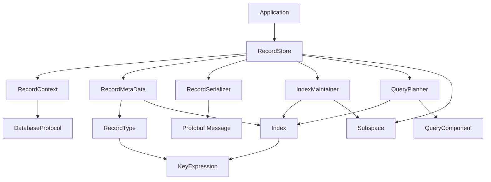

# FoundationDB Record Layer - Swift Implementation

**Version:** 1.0.0
**Date:** 2025-10-31
**Status:** Design Phase

## Table of Contents

1. [Overview](#overview)
2. [Architecture Principles](#architecture-principles)
3. [Core Components](#core-components)
4. [Subspace Management](#subspace-management)
5. [Metadata System](#metadata-system)
6. [Serialization Layer](#serialization-layer)
7. [Transaction Management](#transaction-management)
8. [Record Store](#record-store)
9. [Indexing System](#indexing-system)
10. [Query System](#query-system)
11. [Online Indexer](#online-indexer)
12. [Concurrency Model](#concurrency-model)
13. [Implementation Roadmap](#implementation-roadmap)

---

## Overview

This document describes the Swift implementation of FoundationDB Record Layer, a structured record-oriented store built on top of FoundationDB. The implementation follows the architecture of [fdb-record-layer](https://github.com/FoundationDB/fdb-record-layer) while adapting it to Swift's language features and best practices.

### Key Features

- **Structured Record Storage**: Protocol Buffer-based record schema
- **Secondary Indexes**: Multiple index types (value, rank, count, sum)
- **Query Planning**: Cost-based query optimization
- **Online Index Building**: Build indexes without downtime
- **ACID Transactions**: Full transactional guarantees from FoundationDB
- **Type Safety**: Swift's strong type system with Generics
- **Mutex-based Concurrency**: Thread-safe without Actor model

### Design Goals

1. **Compatibility**: Follow fdb-record-layer's architecture and patterns
2. **Swift Idioms**: Leverage Swift's type system and protocol-oriented design
3. **Performance**: Efficient use of FoundationDB's capabilities
4. **Testability**: Protocol-based design for easy mocking
5. **Maintainability**: Clear separation of concerns

---

## Architecture Principles

### 1. Protocol-Oriented Design

All major components are defined as protocols, allowing for:
- Easy testing with mock implementations
- Flexible composition of behaviors
- Clear contracts between layers

### 2. Sendable Compliance

All types shared across concurrency boundaries conform to `Sendable`:
- Ensures thread-safety at compile time
- Prevents data races
- Works with Swift 6's strict concurrency checking

### 3. Explicit Concurrency Control

Using NSLock/pthread mutex instead of Actor model:
- More control over locking granularity
- Better performance for fine-grained locking
- Familiar patterns from Java implementation

### 4. Immutable Data Structures

Prefer immutable structs for data transfer:
- Thread-safe by default
- Easier to reason about
- Copy-on-write semantics

### 5. Error Handling

Use Swift's typed error system:
```swift
enum RecordLayerError: Error {
    case contextAlreadyClosed
    case indexNotReady(String)
    case invalidMetadata(String)
    case serializationFailed(String)
}
```

---

## Core Components

### High-Level Architecture

```
┌─────────────────────────────────────────────────────────┐
│                   Application Layer                      │
│              (User's Swift/Protobuf Code)                │
└────────────────────┬────────────────────────────────────┘
                     │
┌────────────────────▼────────────────────────────────────┐
│                  RecordStore<M>                          │
│  - saveRecord(_ record: M)                               │
│  - loadRecord(primaryKey: Tuple) -> M?                   │
│  - deleteRecord(primaryKey: Tuple)                       │
│  - executeQuery(_ query: RecordQuery) -> RecordCursor    │
└─────┬──────────┬──────────┬──────────┬─────────────────┘
      │          │          │          │
      ▼          ▼          ▼          ▼
┌──────────┐ ┌────────┐ ┌─────────┐ ┌──────────────┐
│ Record   │ │ Index  │ │  Query  │ │ RecordMeta   │
│ Context  │ │Maintain│ │ Planner │ │    Data      │
│          │ │  er    │ │         │ │              │
└─────┬────┘ └────┬───┘ └────┬────┘ └──────┬───────┘
      │           │          │             │
      └───────────┴──────────┴─────────────┘
                     │
┌────────────────────▼────────────────────────────────────┐
│              RecordSerializer<M>                         │
│  - serialize(_ record: M) -> FDB.Bytes                   │
│  - deserialize(_ bytes: FDB.Bytes) -> M                  │
└────────────────────┬────────────────────────────────────┘
                     │
┌────────────────────▼────────────────────────────────────┐
│               Subspace Management                        │
│  - Key encoding/decoding with Tuple                      │
│  - Namespace isolation                                   │
└────────────────────┬────────────────────────────────────┘
                     │
┌────────────────────▼────────────────────────────────────┐
│         FoundationDB (fdb-swift-bindings)                │
│  - Transaction Management                                │
│  - ACID Guarantees                                       │
│  - Range Queries                                         │
└─────────────────────────────────────────────────────────┘
```

### Component Dependencies



---

## Subspace Management

### Overview

Subspaces provide logical isolation of data within FoundationDB. The Record Layer uses a hierarchical subspace structure to organize records, indexes, and metadata.

### Subspace Structure

```swift
/// FoundationDB subspace for key management
struct Subspace: Sendable {
    let prefix: FDB.Bytes

    init(prefix: FDB.Bytes) {
        self.prefix = prefix
    }

    init(rootPrefix: String) {
        let tuple = Tuple(rootPrefix)
        self.prefix = tuple.encode()
    }

    /// Create a nested subspace
    func subspace(_ elements: TupleElement...) -> Subspace {
        let tuple = Tuple(elements)
        return Subspace(prefix: prefix + tuple.encode())
    }

    /// Encode tuple into a key with prefix
    func pack(_ tuple: Tuple) -> FDB.Bytes {
        return prefix + tuple.encode()
    }

    /// Decode key into tuple, removing prefix
    func unpack(_ key: FDB.Bytes) throws -> Tuple {
        guard key.starts(with: prefix) else {
            throw RecordLayerError.invalidKey("Key does not match subspace prefix")
        }
        let tupleBytes = Array(key.dropFirst(prefix.count))
        return try Tuple.decode(from: tupleBytes)
    }

    /// Get range for scanning all keys in this subspace
    func range() -> (begin: FDB.Bytes, end: FDB.Bytes) {
        var end = prefix
        // Increment last byte for exclusive end key
        if let lastIndex = end.indices.last {
            end[lastIndex] = end[lastIndex] &+ 1
        }
        return (prefix, end)
    }
}
```

### RecordStore Keyspace Layout

```
<root_prefix>
├── [0] STORE_INFO
│   └── "version" → UInt32
│   └── "format_version" → UInt32
│   └── "metadata_version" → UInt64
│
├── [1] RECORD
│   └── [primary_key_tuple...] → serialized_record_bytes
│
├── [2] INDEX
│   ├── [index_subspace_key_1]
│   │   └── [index_entry_tuple...] → value_bytes
│   ├── [index_subspace_key_2]
│   │   └── [index_entry_tuple...] → value_bytes
│   └── ...
│
├── [3] INDEX_SECONDARY_SPACE
│   └── (used by specific index types)
│
├── [5] INDEX_STATE_SPACE
│   └── [index_name] → IndexState (UInt8)
│
├── [6] INDEX_RANGE_SPACE
│   └── [index_name]
│       └── RangeSet (for online index building progress)
│
├── [7] INDEX_UNIQUENESS_VIOLATIONS
│   └── [index_name]
│       └── [violation_tuple...] → violation_info
│
└── [9] INDEX_BUILD_SPACE
    └── [index_name]
        ├── "type" → IndexBuildType
        ├── "method" → IndexBuildMethod
        └── "scanned_records" → UInt64
```

### Keyspace Enum

```swift
/// Record Store keyspace identifiers
enum RecordStoreKeyspace: Int64 {
    case storeInfo = 0
    case record = 1
    case index = 2
    case indexSecondary = 3
    case indexState = 5
    case indexRange = 6
    case indexUniquenessViolations = 7
    case indexBuild = 9
}
```

### Key Encoding Example

```swift
// Create root subspace
let rootSubspace = Subspace(rootPrefix: "my-app")

// Record subspace: ["my-app", 1]
let recordSubspace = rootSubspace.subspace(RecordStoreKeyspace.record.rawValue)

// Specific record: ["my-app", 1, "user", 12345]
let userRecord = recordSubspace.pack(Tuple("user", 12345))

// Index subspace: ["my-app", 2, "user_by_email"]
let indexSubspace = rootSubspace
    .subspace(RecordStoreKeyspace.index.rawValue)
    .subspace("user_by_email")

// Index entry: ["my-app", 2, "user_by_email", "alice@example.com", 12345]
let indexEntry = indexSubspace.pack(Tuple("alice@example.com", 12345))
```

---

## Metadata System

### RecordMetaData

Central schema definition for all record types and indexes.

```swift
/// Record metadata defining schema and indexes
struct RecordMetaData: Sendable {
    /// Version number for schema evolution
    let version: Int

    /// All record types in this metadata
    let recordTypes: [String: RecordType]

    /// All indexes (universal and per-type)
    let indexes: [String: Index]

    /// The union message descriptor (contains all record types)
    let unionDescriptor: UnionDescriptor

    init(
        version: Int,
        recordTypes: [RecordType],
        indexes: [Index],
        unionDescriptor: UnionDescriptor
    ) {
        self.version = version
        self.recordTypes = Dictionary(uniqueKeysWithValues: recordTypes.map { ($0.name, $0) })
        self.indexes = Dictionary(uniqueKeysWithValues: indexes.map { ($0.name, $0) })
        self.unionDescriptor = unionDescriptor
    }

    func getRecordType(_ name: String) throws -> RecordType {
        guard let recordType = recordTypes[name] else {
            throw RecordLayerError.recordTypeNotFound(name)
        }
        return recordType
    }

    func getIndex(_ name: String) throws -> Index {
        guard let index = indexes[name] else {
            throw RecordLayerError.indexNotFound(name)
        }
        return index
    }

    func getIndexesForRecordType(_ recordTypeName: String) -> [Index] {
        return indexes.values.filter { index in
            index.recordTypes == nil || index.recordTypes!.contains(recordTypeName)
        }
    }
}
```

### RecordType

Defines a single record type.

```swift
/// A record type definition
struct RecordType: Sendable {
    /// Unique name of the record type
    let name: String

    /// Primary key expression
    let primaryKey: KeyExpression

    /// Indexes specific to this record type
    let secondaryIndexes: [String]

    /// Protobuf message descriptor reference
    let messageDescriptor: MessageDescriptor

    init(
        name: String,
        primaryKey: KeyExpression,
        secondaryIndexes: [String] = [],
        messageDescriptor: MessageDescriptor
    ) {
        self.name = name
        self.primaryKey = primaryKey
        self.secondaryIndexes = secondaryIndexes
        self.messageDescriptor = messageDescriptor
    }
}
```

### Index

Defines an index on record fields.

```swift
/// Index definition
struct Index: Sendable {
    /// Unique index name
    let name: String

    /// Index type
    let type: IndexType

    /// Root expression defining indexed fields
    let rootExpression: KeyExpression

    /// Subspace key (defaults to index name)
    let subspaceKey: String

    /// Record types this index applies to (nil = universal)
    let recordTypes: Set<String>?

    /// Index options
    let options: IndexOptions

    var subspaceTupleKey: TupleElement {
        return subspaceKey
    }

    init(
        name: String,
        type: IndexType = .value,
        rootExpression: KeyExpression,
        subspaceKey: String? = nil,
        recordTypes: Set<String>? = nil,
        options: IndexOptions = IndexOptions()
    ) {
        self.name = name
        self.type = type
        self.rootExpression = rootExpression
        self.subspaceKey = subspaceKey ?? name
        self.recordTypes = recordTypes
        self.options = options
    }
}

/// Index type
enum IndexType: String, Sendable {
    case value      // Standard B-tree index
    case rank       // Rank/leaderboard index
    case count      // Count aggregation index
    case sum        // Sum aggregation index
    case version    // Version index
    case permuted   // Permuted index (multiple orderings)
}

/// Index options
struct IndexOptions: Sendable {
    var unique: Bool = false
    var replaceOnDuplicate: Bool = false
    var allowedInEquality: Bool = true

    init(
        unique: Bool = false,
        replaceOnDuplicate: Bool = false,
        allowedInEquality: Bool = true
    ) {
        self.unique = unique
        self.replaceOnDuplicate = replaceOnDuplicate
        self.allowedInEquality = allowedInEquality
    }
}

/// Index state
enum IndexState: UInt8, Sendable {
    case readable = 0       // Ready for read and write
    case disabled = 1       // Disabled
    case writeOnly = 2      // Building, writes allowed
    case building = 3       // Building, writes not recommended
}
```

### KeyExpression

Defines how to extract key values from records.

```swift
/// Protocol for key expressions
protocol KeyExpression: Sendable {
    /// Evaluate the expression on a record
    func evaluate(record: Message) -> [TupleElement]

    /// Number of columns this expression produces
    var columnCount: Int { get }
}

/// Field key expression (extracts a single field)
struct FieldKeyExpression: KeyExpression {
    let fieldName: String

    func evaluate(record: Message) -> [TupleElement] {
        // Extract field value using Protobuf reflection
        guard let value = extractField(from: record, fieldName: fieldName) else {
            return [TupleNil()]
        }
        return [value]
    }

    var columnCount: Int { 1 }

    private func extractField(from record: Message, fieldName: String) -> TupleElement? {
        // Implementation using SwiftProtobuf reflection
        // This will be implemented with proper Protobuf descriptor access
        fatalError("Not yet implemented")
    }
}

/// Concatenate key expression (combines multiple expressions)
struct ConcatenateKeyExpression: KeyExpression {
    let children: [KeyExpression]

    func evaluate(record: Message) -> [TupleElement] {
        return children.flatMap { $0.evaluate(record: record) }
    }

    var columnCount: Int {
        children.reduce(0) { $0 + $1.columnCount }
    }
}

/// Nest expression (adds prefix to key)
struct NestExpression: KeyExpression {
    let parent: FieldKeyExpression
    let child: KeyExpression

    func evaluate(record: Message) -> [TupleElement] {
        // First evaluate parent to get nested message
        // Then evaluate child on nested message
        fatalError("Not yet implemented")
    }

    var columnCount: Int {
        child.columnCount
    }
}
```

### MetaData Builder

```swift
/// Builder for constructing RecordMetaData
class RecordMetaDataBuilder {
    private var version: Int = 1
    private var recordTypes: [RecordType] = []
    private var indexes: [Index] = []
    private var unionDescriptor: UnionDescriptor?

    func setVersion(_ version: Int) -> Self {
        self.version = version
        return self
    }

    func addRecordType(_ recordType: RecordType) -> Self {
        recordTypes.append(recordType)
        return self
    }

    func addIndex(_ index: Index) -> Self {
        indexes.append(index)
        return self
    }

    func setUnionDescriptor(_ descriptor: UnionDescriptor) -> Self {
        self.unionDescriptor = descriptor
        return self
    }

    func build() throws -> RecordMetaData {
        guard let unionDescriptor = unionDescriptor else {
            throw RecordLayerError.missingUnionDescriptor
        }

        return RecordMetaData(
            version: version,
            recordTypes: recordTypes,
            indexes: indexes,
            unionDescriptor: unionDescriptor
        )
    }
}
```

---

## Serialization Layer

### RecordSerializer Protocol

```swift
/// Protocol for serializing records to/from bytes
protocol RecordSerializer: Sendable {
    associatedtype M: Message

    /// Serialize a record to bytes
    func serialize(_ record: M) throws -> FDB.Bytes

    /// Deserialize bytes to a record
    func deserialize(_ bytes: FDB.Bytes) throws -> M

    /// Validate serialization round-trip
    func validateSerialization(_ record: M) throws

    /// Get the message descriptor
    var descriptor: MessageDescriptor { get }
}
```

### Protobuf Serializer

```swift
/// Protobuf-based record serializer
struct ProtobufRecordSerializer<M: Message>: RecordSerializer {
    let descriptor: MessageDescriptor

    init() {
        self.descriptor = M.messageDescriptor
    }

    func serialize(_ record: M) throws -> FDB.Bytes {
        do {
            return try Array(record.serializedData())
        } catch {
            throw RecordLayerError.serializationFailed("Protobuf serialization failed: \(error)")
        }
    }

    func deserialize(_ bytes: FDB.Bytes) throws -> M {
        do {
            let data = Data(bytes)
            return try M(serializedData: data)
        } catch {
            throw RecordLayerError.deserializationFailed("Protobuf deserialization failed: \(error)")
        }
    }

    func validateSerialization(_ record: M) throws {
        let serialized = try serialize(record)
        let deserialized = try deserialize(serialized)

        guard record == deserialized else {
            throw RecordLayerError.serializationValidationFailed(
                "Round-trip serialization produced different record"
            )
        }
    }
}
```

### Transformed Serializer

Adds compression and encryption transformations.

```swift
/// Serializer with transformations (compression, encryption)
struct TransformedRecordSerializer<M: Message>: RecordSerializer {
    private let inner: ProtobufRecordSerializer<M>
    private let compression: CompressionType?
    private let encryption: EncryptionType?

    var descriptor: MessageDescriptor {
        inner.descriptor
    }

    enum CompressionType {
        case zlib
        case lz4
    }

    enum EncryptionType {
        case aes256(key: Data)
    }

    init(
        compression: CompressionType? = nil,
        encryption: EncryptionType? = nil
    ) {
        self.inner = ProtobufRecordSerializer<M>()
        self.compression = compression
        self.encryption = encryption
    }

    func serialize(_ record: M) throws -> FDB.Bytes {
        var bytes = try inner.serialize(record)
        var encoding: UInt8 = 0

        // Apply compression
        if let compression = compression {
            bytes = try compress(bytes, using: compression)
            encoding |= 0x01 // Set compression bit
        }

        // Apply encryption
        if let encryption = encryption {
            bytes = try encrypt(bytes, using: encryption)
            encoding |= 0x02 // Set encryption bit
        }

        // Prepend encoding byte
        return [encoding] + bytes
    }

    func deserialize(_ bytes: FDB.Bytes) throws -> M {
        guard let encoding = bytes.first else {
            throw RecordLayerError.invalidSerializedData("Empty data")
        }

        var data = Array(bytes.dropFirst())

        // Decrypt if needed
        if encoding & 0x02 != 0 {
            guard let encryption = encryption else {
                throw RecordLayerError.deserializationFailed("Encryption key not provided")
            }
            data = try decrypt(data, using: encryption)
        }

        // Decompress if needed
        if encoding & 0x01 != 0 {
            guard let compression = compression else {
                throw RecordLayerError.deserializationFailed("Compression type not specified")
            }
            data = try decompress(data, using: compression)
        }

        return try inner.deserialize(data)
    }

    func validateSerialization(_ record: M) throws {
        try inner.validateSerialization(record)
    }

    // MARK: - Private helpers

    private func compress(_ data: FDB.Bytes, using type: CompressionType) throws -> FDB.Bytes {
        // Implementation using Compression framework
        fatalError("Not yet implemented")
    }

    private func decompress(_ data: FDB.Bytes, using type: CompressionType) throws -> FDB.Bytes {
        // Implementation using Compression framework
        fatalError("Not yet implemented")
    }

    private func encrypt(_ data: FDB.Bytes, using type: EncryptionType) throws -> FDB.Bytes {
        // Implementation using CryptoKit
        fatalError("Not yet implemented")
    }

    private func decrypt(_ data: FDB.Bytes, using type: EncryptionType) throws -> FDB.Bytes {
        // Implementation using CryptoKit
        fatalError("Not yet implemented")
    }
}
```

---

## Transaction Management

### RecordContext

Manages the transaction lifecycle.

```swift
/// Record context managing a single transaction
class RecordContext: @unchecked Sendable {
    private let transaction: any TransactionProtocol
    private let lock = NSLock()
    private var _isClosed = false

    var isClosed: Bool {
        lock.lock()
        defer { lock.unlock() }
        return _isClosed
    }

    init(transaction: any TransactionProtocol) {
        self.transaction = transaction
    }

    convenience init(database: any DatabaseProtocol) throws {
        let transaction = try database.createTransaction()
        self.init(transaction: transaction)
    }

    /// Commit the transaction
    func commit() async throws {
        lock.lock()
        guard !_isClosed else {
            lock.unlock()
            throw RecordLayerError.contextAlreadyClosed
        }
        lock.unlock()

        _ = try await transaction.commit()

        lock.lock()
        _isClosed = true
        lock.unlock()
    }

    /// Cancel the transaction
    func cancel() {
        lock.lock()
        defer { lock.unlock() }

        guard !_isClosed else { return }
        transaction.cancel()
        _isClosed = true
    }

    /// Get the underlying transaction
    func getTransaction() -> any TransactionProtocol {
        return transaction
    }

    deinit {
        if !isClosed {
            cancel()
        }
    }
}
```

### Automatic Transaction Management

```swift
extension DatabaseProtocol {
    /// Execute a block within a transaction with automatic retry
    func withRecordContext<T>(
        _ block: (RecordContext) async throws -> T
    ) async throws -> T {
        return try await withTransaction { transaction in
            let context = RecordContext(transaction: transaction)
            return try await block(context)
        }
    }
}
```

---

## Record Store

### RecordStore Class

The main interface for record operations.

```swift
/// Record store for managing records and indexes
class RecordStore<M: Message>: @unchecked Sendable {
    // MARK: - Properties

    private let database: any DatabaseProtocol
    private let subspace: Subspace
    private let metaData: RecordMetaData
    private let serializer: any RecordSerializer<M>
    private let lock = NSLock()

    // Subspaces
    private let recordSubspace: Subspace
    private let indexSubspace: Subspace
    private let indexStateSubspace: Subspace
    private let storeInfoSubspace: Subspace

    // MARK: - Initialization

    init(
        database: any DatabaseProtocol,
        subspace: Subspace,
        metaData: RecordMetaData,
        serializer: any RecordSerializer<M>
    ) {
        self.database = database
        self.subspace = subspace
        self.metaData = metaData
        self.serializer = serializer

        // Initialize subspaces
        self.recordSubspace = subspace.subspace(RecordStoreKeyspace.record.rawValue)
        self.indexSubspace = subspace.subspace(RecordStoreKeyspace.index.rawValue)
        self.indexStateSubspace = subspace.subspace(RecordStoreKeyspace.indexState.rawValue)
        self.storeInfoSubspace = subspace.subspace(RecordStoreKeyspace.storeInfo.rawValue)
    }

    // MARK: - Record Operations

    /// Save a record
    func saveRecord(_ record: M, context: RecordContext) async throws {
        let transaction = context.getTransaction()

        // 1. Extract record type
        let recordType = try getRecordType(for: record)

        // 2. Extract primary key
        let primaryKey = try extractPrimaryKey(record, recordType: recordType)

        // 3. Load existing record (if any)
        let existingRecord = try await loadRecord(primaryKey: primaryKey, context: context)

        // 4. Serialize new record
        let serialized = try serializer.serialize(record)

        // 5. Save record
        let recordKey = recordSubspace.pack(primaryKey)
        transaction.setValue(serialized, for: recordKey)

        // 6. Update indexes
        try await updateIndexesForRecord(
            oldRecord: existingRecord,
            newRecord: record,
            recordType: recordType,
            transaction: transaction
        )
    }

    /// Load a record by primary key
    func loadRecord(primaryKey: Tuple, context: RecordContext) async throws -> M? {
        let transaction = context.getTransaction()
        let recordKey = recordSubspace.pack(primaryKey)

        guard let bytes = try await transaction.getValue(for: recordKey) else {
            return nil
        }

        return try serializer.deserialize(bytes)
    }

    /// Delete a record by primary key
    func deleteRecord(primaryKey: Tuple, context: RecordContext) async throws {
        let transaction = context.getTransaction()

        // 1. Load existing record
        guard let existingRecord = try await loadRecord(primaryKey: primaryKey, context: context) else {
            return // Record doesn't exist
        }

        // 2. Get record type
        let recordType = try getRecordType(for: existingRecord)

        // 3. Delete record
        let recordKey = recordSubspace.pack(primaryKey)
        transaction.clear(key: recordKey)

        // 4. Update indexes
        try await updateIndexesForRecord(
            oldRecord: existingRecord,
            newRecord: nil,
            recordType: recordType,
            transaction: transaction
        )
    }

    // MARK: - Query Operations

    /// Execute a query
    func executeQuery(_ query: RecordQuery, context: RecordContext) async throws -> RecordCursor<M> {
        let planner = RecordQueryPlanner(metaData: metaData)
        let plan = try planner.plan(query)
        return try await plan.execute(store: self, context: context)
    }

    // MARK: - Index Management

    /// Get index state
    func getIndexState(_ indexName: String, context: RecordContext) async throws -> IndexState {
        let transaction = context.getTransaction()
        let stateKey = indexStateSubspace.pack(Tuple(indexName))

        guard let bytes = try await transaction.getValue(for: stateKey),
              let stateValue = bytes.first else {
            return .building // Default state
        }

        guard let state = IndexState(rawValue: stateValue) else {
            throw RecordLayerError.invalidIndexState(stateValue)
        }

        return state
    }

    /// Set index state
    func setIndexState(_ indexName: String, state: IndexState, context: RecordContext) {
        let transaction = context.getTransaction()
        let stateKey = indexStateSubspace.pack(Tuple(indexName))
        transaction.setValue([state.rawValue], for: stateKey)
    }

    // MARK: - Internal Methods

    private func getRecordType(for record: M) throws -> RecordType {
        // Determine record type from union message
        // This requires Protobuf reflection
        fatalError("Not yet implemented")
    }

    private func extractPrimaryKey(_ record: M, recordType: RecordType) throws -> Tuple {
        let elements = recordType.primaryKey.evaluate(record: record)
        return Tuple(elements)
    }

    private func updateIndexesForRecord(
        oldRecord: M?,
        newRecord: M?,
        recordType: RecordType,
        transaction: any TransactionProtocol
    ) async throws {
        let indexes = metaData.getIndexesForRecordType(recordType.name)

        for index in indexes {
            // Check if index is ready
            // (In production, we'd check index state here)

            let maintainer = createIndexMaintainer(for: index)
            try await maintainer.updateIndex(
                oldRecord: oldRecord,
                newRecord: newRecord,
                transaction: transaction
            )
        }
    }

    private func createIndexMaintainer(for index: Index) -> any IndexMaintainer {
        let indexSubspace = self.indexSubspace.subspace(index.subspaceTupleKey)

        switch index.type {
        case .value:
            return ValueIndexMaintainer(
                index: index,
                subspace: indexSubspace,
                recordSubspace: recordSubspace
            )
        case .rank:
            return RankIndexMaintainer(
                index: index,
                subspace: indexSubspace
            )
        case .count:
            return CountIndexMaintainer(
                index: index,
                subspace: indexSubspace
            )
        case .sum:
            return SumIndexMaintainer(
                index: index,
                subspace: indexSubspace
            )
        case .version, .permuted:
            fatalError("Index type \(index.type) not yet implemented")
        }
    }
}
```

---

## Indexing System

### IndexMaintainer Protocol

```swift
/// Protocol for maintaining an index
protocol IndexMaintainer: Sendable {
    /// Update index entries when a record changes
    func updateIndex(
        oldRecord: Message?,
        newRecord: Message?,
        transaction: any TransactionProtocol
    ) async throws

    /// Scan and build index entries for a record
    func scanRecord(
        _ record: Message,
        primaryKey: Tuple,
        transaction: any TransactionProtocol
    ) async throws
}
```

### Value Index Maintainer

```swift
/// Maintainer for value indexes (standard B-tree)
struct ValueIndexMaintainer: IndexMaintainer {
    let index: Index
    let subspace: Subspace
    let recordSubspace: Subspace

    func updateIndex(
        oldRecord: Message?,
        newRecord: Message?,
        transaction: any TransactionProtocol
    ) async throws {
        // Remove old index entry
        if let oldRecord = oldRecord {
            let oldKey = try buildIndexKey(record: oldRecord)
            transaction.clear(key: oldKey)
        }

        // Add new index entry
        if let newRecord = newRecord {
            let newKey = try buildIndexKey(record: newRecord)
            let value = try buildIndexValue(record: newRecord)
            transaction.setValue(value, for: newKey)
        }
    }

    func scanRecord(
        _ record: Message,
        primaryKey: Tuple,
        transaction: any TransactionProtocol
    ) async throws {
        let indexKey = try buildIndexKey(record: record)
        let value = try buildIndexValue(record: record)
        transaction.setValue(value, for: indexKey)
    }

    // MARK: - Private

    private func buildIndexKey(record: Message) throws -> FDB.Bytes {
        // Evaluate index expression
        let indexedValues = index.rootExpression.evaluate(record: record)

        // Add primary key for uniqueness
        let primaryKeyValues = extractPrimaryKeyValues(from: record)
        let allValues = indexedValues + primaryKeyValues

        return subspace.pack(Tuple(allValues))
    }

    private func buildIndexValue(record: Message) throws -> FDB.Bytes {
        // For value indexes, we typically store empty value
        // or primary key (if not already in key)
        return FDB.Bytes()
    }

    private func extractPrimaryKeyValues(from record: Message) -> [TupleElement] {
        // Extract primary key from record
        fatalError("Not yet implemented")
    }
}
```

### Count Index Maintainer

```swift
/// Maintainer for count aggregation indexes
struct CountIndexMaintainer: IndexMaintainer {
    let index: Index
    let subspace: Subspace

    func updateIndex(
        oldRecord: Message?,
        newRecord: Message?,
        transaction: any TransactionProtocol
    ) async throws {
        // Determine grouping key
        let groupingKey: Tuple

        if let newRecord = newRecord {
            let values = index.rootExpression.evaluate(record: newRecord)
            groupingKey = Tuple(values)
        } else if let oldRecord = oldRecord {
            let values = index.rootExpression.evaluate(record: oldRecord)
            groupingKey = Tuple(values)
        } else {
            return
        }

        let countKey = subspace.pack(groupingKey)

        // Increment or decrement count atomically
        let delta: Int64 = (newRecord != nil ? 1 : 0) - (oldRecord != nil ? 1 : 0)
        let deltaBytes = withUnsafeBytes(of: delta.littleEndian) { Array($0) }
        transaction.atomicOp(key: countKey, param: deltaBytes, mutationType: .add)
    }

    func scanRecord(
        _ record: Message,
        primaryKey: Tuple,
        transaction: any TransactionProtocol
    ) async throws {
        let values = index.rootExpression.evaluate(record: record)
        let groupingKey = Tuple(values)
        let countKey = subspace.pack(groupingKey)

        let increment = withUnsafeBytes(of: Int64(1).littleEndian) { Array($0) }
        transaction.atomicOp(key: countKey, param: increment, mutationType: .add)
    }
}
```

### Rank Index Maintainer

```swift
/// Maintainer for rank/leaderboard indexes
struct RankIndexMaintainer: IndexMaintainer {
    let index: Index
    let subspace: Subspace

    func updateIndex(
        oldRecord: Message?,
        newRecord: Message?,
        transaction: any TransactionProtocol
    ) async throws {
        // Rank indexes use special structure for efficient ranking
        // Implementation requires additional complexity
        fatalError("Rank index not yet implemented")
    }

    func scanRecord(
        _ record: Message,
        primaryKey: Tuple,
        transaction: any TransactionProtocol
    ) async throws {
        fatalError("Rank index not yet implemented")
    }
}
```

### Sum Index Maintainer

```swift
/// Maintainer for sum aggregation indexes
struct SumIndexMaintainer: IndexMaintainer {
    let index: Index
    let subspace: Subspace

    func updateIndex(
        oldRecord: Message?,
        newRecord: Message?,
        transaction: any TransactionProtocol
    ) async throws {
        // Extract grouping key and sum value
        // Use atomic operations to maintain sum
        fatalError("Sum index not yet implemented")
    }

    func scanRecord(
        _ record: Message,
        primaryKey: Tuple,
        transaction: any TransactionProtocol
    ) async throws {
        fatalError("Sum index not yet implemented")
    }
}
```

---

## Query System

### RecordQuery

Query definition structure.

```swift
/// A query for records
struct RecordQuery: Sendable {
    let recordTypes: Set<String>
    let filter: QueryComponent?
    let sort: [SortKey]?
    let limit: Int?
    let continuation: Continuation?

    init(
        recordType: String,
        filter: QueryComponent? = nil,
        sort: [SortKey]? = nil,
        limit: Int? = nil,
        continuation: Continuation? = nil
    ) {
        self.recordTypes = [recordType]
        self.filter = filter
        self.sort = sort
        self.limit = limit
        self.continuation = continuation
    }
}

/// Sort key specification
struct SortKey: Sendable {
    let expression: KeyExpression
    let ascending: Bool

    init(expression: KeyExpression, ascending: Bool = true) {
        self.expression = expression
        self.ascending = ascending
    }
}

/// Continuation token for pagination
struct Continuation: Sendable {
    let data: Data
}
```

### QueryComponent

Filter conditions.

```swift
/// Protocol for query filter components
protocol QueryComponent: Sendable {
    func matches(record: Message) -> Bool
}

/// Field comparison component
struct FieldQueryComponent: QueryComponent {
    let fieldName: String
    let comparison: Comparison
    let value: TupleElement

    enum Comparison: Sendable {
        case equals
        case notEquals
        case lessThan
        case lessThanOrEquals
        case greaterThan
        case greaterThanOrEquals
        case startsWith
        case contains
    }

    func matches(record: Message) -> Bool {
        // Extract field value and compare
        fatalError("Not yet implemented")
    }
}

/// AND component
struct AndQueryComponent: QueryComponent {
    let children: [QueryComponent]

    func matches(record: Message) -> Bool {
        return children.allSatisfy { $0.matches(record: record) }
    }
}

/// OR component
struct OrQueryComponent: QueryComponent {
    let children: [QueryComponent]

    func matches(record: Message) -> Bool {
        return children.contains { $0.matches(record: record) }
    }
}

/// NOT component
struct NotQueryComponent: QueryComponent {
    let child: QueryComponent

    func matches(record: Message) -> Bool {
        return !child.matches(record: record)
    }
}
```

### QueryPlanner

```swift
/// Query planner for generating execution plans
class RecordQueryPlanner {
    let metaData: RecordMetaData
    let configuration: PlannerConfiguration

    init(
        metaData: RecordMetaData,
        configuration: PlannerConfiguration = PlannerConfiguration()
    ) {
        self.metaData = metaData
        self.configuration = configuration
    }

    /// Generate an execution plan for a query
    func plan(_ query: RecordQuery) throws -> QueryPlan {
        // 1. Normalize filter to DNF (Disjunctive Normal Form)
        let normalizedFilter = normalizeFilter(query.filter)

        // 2. Generate candidate plans
        let candidates = try generateCandidatePlans(query: query, filter: normalizedFilter)

        // 3. Score and select best plan
        let bestPlan = try selectBestPlan(candidates)

        // 4. Apply limit if specified
        if let limit = query.limit {
            return LimitPlan(child: bestPlan, limit: limit)
        }

        return bestPlan
    }

    // MARK: - Private

    private func normalizeFilter(_ filter: QueryComponent?) -> QueryComponent? {
        guard let filter = filter else { return nil }
        // Apply Boolean normalization
        return BooleanNormalizer.normalize(filter)
    }

    private func generateCandidatePlans(
        query: RecordQuery,
        filter: QueryComponent?
    ) throws -> [ScoredPlan] {
        var candidates: [ScoredPlan] = []

        // Generate index scan plans
        for (_, index) in metaData.indexes {
            if let plan = try generateIndexScanPlan(query: query, index: index, filter: filter) {
                let score = scorePlan(plan)
                candidates.append(ScoredPlan(plan: plan, score: score))
            }
        }

        // Generate full scan plan as fallback
        let scanPlan = FullScanPlan(recordTypes: query.recordTypes, filter: filter)
        let scanScore = scorePlan(scanPlan)
        candidates.append(ScoredPlan(plan: scanPlan, score: scanScore))

        return candidates
    }

    private func generateIndexScanPlan(
        query: RecordQuery,
        index: Index,
        filter: QueryComponent?
    ) throws -> QueryPlan? {
        // Determine if index can be used for this query
        // This is complex logic involving filter analysis
        fatalError("Not yet implemented")
    }

    private func selectBestPlan(_ candidates: [ScoredPlan]) throws -> QueryPlan {
        guard let best = candidates.min(by: { $0.score < $1.score }) else {
            throw RecordLayerError.noValidPlan
        }
        return best.plan
    }

    private func scorePlan(_ plan: QueryPlan) -> Int {
        // Cost estimation based on plan type
        // Lower score = better plan
        fatalError("Not yet implemented")
    }
}

/// Plan with score
struct ScoredPlan {
    let plan: QueryPlan
    let score: Int
}

/// Planner configuration
struct PlannerConfiguration {
    var indexScanPreference: Int = 1
    var maxComplexity: Int = 10000
}
```

### QueryPlan Protocol

```swift
/// Protocol for query execution plans
protocol QueryPlan: Sendable {
    func execute<M: Message>(
        store: RecordStore<M>,
        context: RecordContext
    ) async throws -> RecordCursor<M>
}

/// Index scan plan
struct IndexScanPlan: QueryPlan {
    let index: Index
    let scanRange: ScanRange
    let filter: QueryComponent?

    func execute<M: Message>(
        store: RecordStore<M>,
        context: RecordContext
    ) async throws -> RecordCursor<M> {
        // Execute index scan
        fatalError("Not yet implemented")
    }
}

/// Full table scan plan
struct FullScanPlan: QueryPlan {
    let recordTypes: Set<String>
    let filter: QueryComponent?

    func execute<M: Message>(
        store: RecordStore<M>,
        context: RecordContext
    ) async throws -> RecordCursor<M> {
        // Execute full scan
        fatalError("Not yet implemented")
    }
}

/// Filter plan (applies filter after data retrieval)
struct FilterPlan: QueryPlan {
    let child: QueryPlan
    let filter: QueryComponent

    func execute<M: Message>(
        store: RecordStore<M>,
        context: RecordContext
    ) async throws -> RecordCursor<M> {
        let childCursor = try await child.execute(store: store, context: context)
        return FilteredCursor(source: childCursor, filter: filter)
    }
}

/// Limit plan
struct LimitPlan: QueryPlan {
    let child: QueryPlan
    let limit: Int

    func execute<M: Message>(
        store: RecordStore<M>,
        context: RecordContext
    ) async throws -> RecordCursor<M> {
        let childCursor = try await child.execute(store: store, context: context)
        return LimitedCursor(source: childCursor, limit: limit)
    }
}

/// Scan range for index scans
struct ScanRange: Sendable {
    let begin: FDB.Bytes
    let end: FDB.Bytes
}
```

### RecordCursor

```swift
/// Cursor for iterating over query results
protocol RecordCursor<Element>: AsyncSequence where Element: Message {
    /// Get continuation for resuming iteration
    func getContinuation() -> Continuation?
}

/// Base cursor implementation
struct BasicRecordCursor<M: Message>: RecordCursor {
    typealias Element = M

    private let sequence: any AsyncSequence<(FDB.Bytes, FDB.Bytes), Error>
    private let serializer: any RecordSerializer<M>

    struct AsyncIterator: AsyncIteratorProtocol {
        var iterator: any AsyncIteratorProtocol
        let serializer: any RecordSerializer<M>

        mutating func next() async throws -> M? {
            guard let (_, value) = try await iterator.next() as? (FDB.Bytes, FDB.Bytes) else {
                return nil
            }
            return try serializer.deserialize(value)
        }
    }

    func makeAsyncIterator() -> AsyncIterator {
        return AsyncIterator(
            iterator: sequence.makeAsyncIterator(),
            serializer: serializer
        )
    }

    func getContinuation() -> Continuation? {
        // Implementation depends on FoundationDB cursor state
        return nil
    }
}

/// Filtered cursor
struct FilteredCursor<Source: RecordCursor>: RecordCursor {
    typealias Element = Source.Element

    let source: Source
    let filter: QueryComponent

    struct AsyncIterator: AsyncIteratorProtocol {
        var sourceIterator: Source.AsyncIterator
        let filter: QueryComponent

        mutating func next() async throws -> Element? {
            while let record = try await sourceIterator.next() {
                if filter.matches(record: record) {
                    return record
                }
            }
            return nil
        }
    }

    func makeAsyncIterator() -> AsyncIterator {
        return AsyncIterator(
            sourceIterator: source.makeAsyncIterator(),
            filter: filter
        )
    }

    func getContinuation() -> Continuation? {
        return source.getContinuation()
    }
}

/// Limited cursor
struct LimitedCursor<Source: RecordCursor>: RecordCursor {
    typealias Element = Source.Element

    let source: Source
    let limit: Int

    struct AsyncIterator: AsyncIteratorProtocol {
        var sourceIterator: Source.AsyncIterator
        let limit: Int
        var count = 0

        mutating func next() async throws -> Element? {
            guard count < limit else { return nil }
            count += 1
            return try await sourceIterator.next()
        }
    }

    func makeAsyncIterator() -> AsyncIterator {
        return AsyncIterator(
            sourceIterator: source.makeAsyncIterator(),
            limit: limit
        )
    }

    func getContinuation() -> Continuation? {
        return source.getContinuation()
    }
}
```

---

## Online Indexer

### OnlineIndexer

Builds indexes without blocking writes.

```swift
/// Online index builder
class OnlineIndexer {
    private let store: any RecordStoreProtocol
    private let index: Index
    private let database: any DatabaseProtocol
    private let lock = NSLock()

    private var _state: IndexBuildState

    struct IndexBuildState {
        var totalRecordsScanned: UInt64 = 0
        var rangesCompleted: RangeSet = RangeSet()
        var startTime: Date?
        var endTime: Date?
    }

    init(
        store: any RecordStoreProtocol,
        index: Index,
        database: any DatabaseProtocol
    ) {
        self.store = store
        self.index = index
        self.database = database
        self._state = IndexBuildState()
    }

    /// Build the index
    func buildIndex() async throws {
        lock.lock()
        _state.startTime = Date()
        lock.unlock()

        // Mark index as building
        try await database.withRecordContext { context in
            store.setIndexState(index.name, state: .building, context: context)
        }

        // Scan records and build index
        try await scanAndBuildIndex()

        // Mark index as readable
        try await database.withRecordContext { context in
            store.setIndexState(index.name, state: .readable, context: context)
        }

        lock.lock()
        _state.endTime = Date()
        lock.unlock()
    }

    private func scanAndBuildIndex() async throws {
        // Scan all records in batches
        let batchSize = 1000
        var continuation: Continuation? = nil

        repeat {
            let (batch, nextContinuation) = try await scanBatch(
                limit: batchSize,
                continuation: continuation
            )

            try await processBatch(batch)

            continuation = nextContinuation
        } while continuation != nil
    }

    private func scanBatch(
        limit: Int,
        continuation: Continuation?
    ) async throws -> ([(Tuple, Message)], Continuation?) {
        // Scan a batch of records
        fatalError("Not yet implemented")
    }

    private func processBatch(_ batch: [(Tuple, Message)]) async throws {
        try await database.withRecordContext { context in
            let transaction = context.getTransaction()
            let maintainer = store.createIndexMaintainer(for: index)

            for (primaryKey, record) in batch {
                try await maintainer.scanRecord(
                    record,
                    primaryKey: primaryKey,
                    transaction: transaction
                )
            }
        }

        lock.lock()
        _state.totalRecordsScanned += UInt64(batch.count)
        lock.unlock()
    }

    /// Get build progress
    func getProgress() -> Double {
        lock.lock()
        defer { lock.unlock() }

        // Calculate progress based on ranges completed
        return _state.rangesCompleted.coverage()
    }
}

/// Range set for tracking index build progress
struct RangeSet: Sendable {
    private var ranges: [(FDB.Bytes, FDB.Bytes)] = []

    mutating func addRange(_ range: (FDB.Bytes, FDB.Bytes)) {
        ranges.append(range)
        // Merge overlapping ranges
        mergeRanges()
    }

    func coverage() -> Double {
        // Calculate percentage of total key space covered
        // This is approximate
        return 0.0
    }

    private mutating func mergeRanges() {
        // Merge overlapping ranges
        // Implementation omitted for brevity
    }
}
```

---

## Concurrency Model

### Mutex-based Synchronization

All shared mutable state is protected by NSLock:

```swift
class ThreadSafeComponent: @unchecked Sendable {
    private let lock = NSLock()
    private var _state: State

    var state: State {
        lock.lock()
        defer { lock.unlock() }
        return _state
    }

    func updateState(_ newState: State) {
        lock.lock()
        defer { lock.unlock() }
        _state = newState
    }
}
```

### Lock Ordering

To prevent deadlocks, always acquire locks in this order:
1. RecordStore lock
2. RecordContext lock
3. Component-specific locks

### Atomic Operations

Use FoundationDB's atomic operations for counters and aggregates:
```swift
// Increment counter atomically
let increment = withUnsafeBytes(of: Int64(1).littleEndian) { Array($0) }
transaction.atomicOp(key: counterKey, param: increment, mutationType: .add)
```

### Transaction Retries

FoundationDB automatically retries transactions on conflicts. Ensure all operations within a transaction are idempotent or use proper conflict ranges.

---

## Implementation Roadmap

### Phase 1: Foundation (Weeks 1-2)

**Goal:** Establish core infrastructure

- [ ] Subspace implementation and tests
- [ ] RecordMetaData structures
- [ ] KeyExpression implementations
- [ ] ProtobufRecordSerializer
- [ ] Basic error types

**Deliverables:**
- Subspace.swift
- RecordMetaData.swift
- KeyExpression.swift
- RecordSerializer.swift
- Tests for each component

### Phase 2: Record Store (Weeks 3-4)

**Goal:** Implement core CRUD operations

- [ ] RecordContext implementation
- [ ] RecordStore class
- [ ] Basic CRUD operations (save, load, delete)
- [ ] Primary key extraction
- [ ] Store info management

**Deliverables:**
- RecordContext.swift
- RecordStore.swift
- Integration tests with FoundationDB

### Phase 3: Indexing (Weeks 5-6)

**Goal:** Implement index maintenance

- [ ] IndexMaintainer protocol
- [ ] ValueIndexMaintainer
- [ ] CountIndexMaintainer
- [ ] SumIndexMaintainer
- [ ] Index state management

**Deliverables:**
- IndexMaintainer.swift
- ValueIndex.swift
- CountIndex.swift
- SumIndex.swift
- Index integration tests

### Phase 4: Query System (Weeks 7-8)

**Goal:** Implement query planning and execution

- [ ] RecordQuery structures
- [ ] QueryComponent implementations
- [ ] RecordQueryPlanner
- [ ] QueryPlan implementations
- [ ] RecordCursor implementations

**Deliverables:**
- RecordQuery.swift
- QueryComponent.swift
- RecordQueryPlanner.swift
- QueryPlan.swift
- RecordCursor.swift
- Query tests

### Phase 5: Online Indexer (Weeks 9-10)

**Goal:** Enable index building without downtime

- [ ] OnlineIndexer implementation
- [ ] RangeSet for progress tracking
- [ ] Index state transitions
- [ ] Throttling and rate limiting

**Deliverables:**
- OnlineIndexer.swift
- RangeSet.swift
- Online indexer tests

### Phase 6: Advanced Features (Weeks 11-12)

**Goal:** Add advanced capabilities

- [ ] TransformedRecordSerializer (compression, encryption)
- [ ] Rank index implementation
- [ ] Query optimization improvements
- [ ] Performance tuning

**Deliverables:**
- TransformedSerializer.swift
- RankIndex.swift
- Performance benchmarks
- Optimization documentation

### Phase 7: Polish and Documentation (Weeks 13-14)

**Goal:** Production readiness

- [ ] Comprehensive documentation
- [ ] Example applications
- [ ] Migration guide
- [ ] Performance guide
- [ ] API refinements

**Deliverables:**
- Complete API documentation
- Tutorial and examples
- Migration guide from RDF Layer
- Performance benchmarks

---

## Testing Strategy

### Unit Tests

Each component should have comprehensive unit tests:
- Subspace encoding/decoding
- KeyExpression evaluation
- Serialization round-trips
- Index maintainer logic

### Integration Tests

Test interactions with real FoundationDB:
- RecordStore CRUD operations
- Index maintenance
- Query execution
- Transaction handling

### Performance Tests

Benchmark critical paths:
- Batch insert performance
- Query performance with various indexes
- Online index building speed

### Chaos Tests

Test resilience:
- Transaction conflicts
- Retry logic
- Index state consistency

---

## References

- [FoundationDB Record Layer (Java)](https://github.com/FoundationDB/fdb-record-layer)
- [fdb-swift-bindings](https://github.com/foundationdb/fdb-swift-bindings)
- [FoundationDB Documentation](https://apple.github.io/foundationdb/)
- [Swift Protobuf](https://github.com/apple/swift-protobuf)
