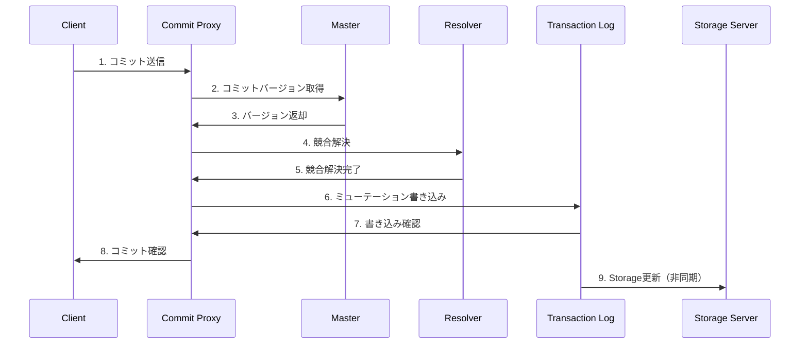
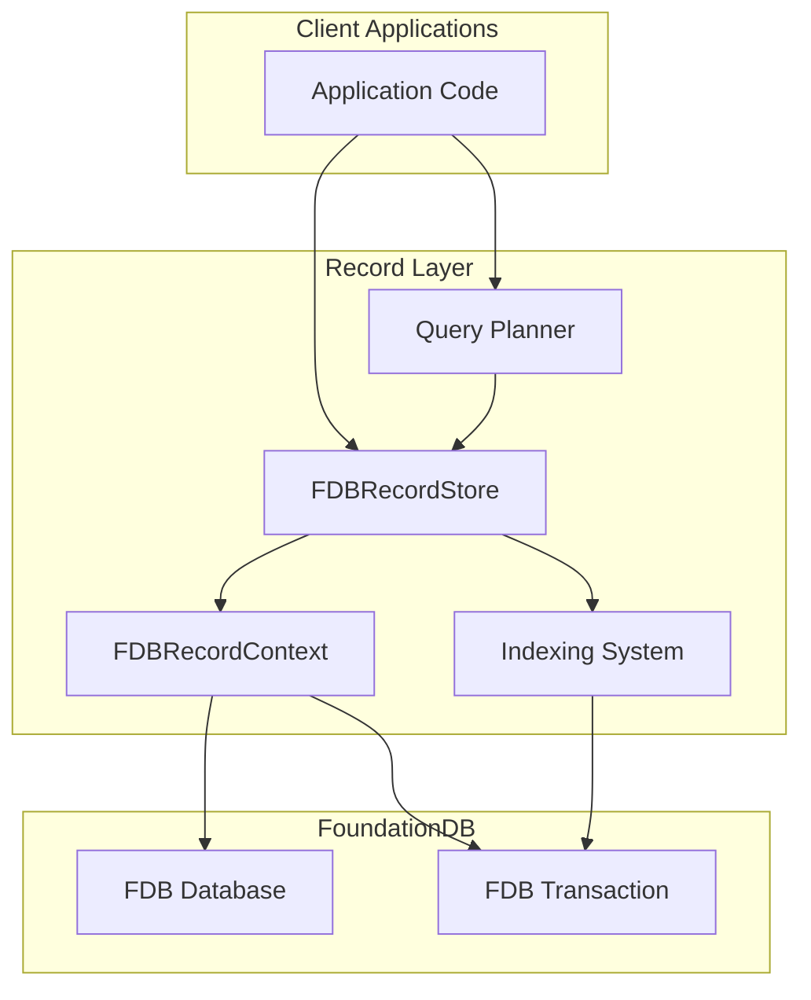
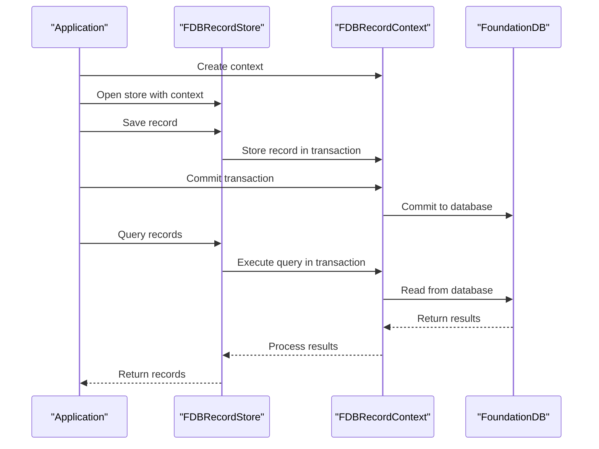
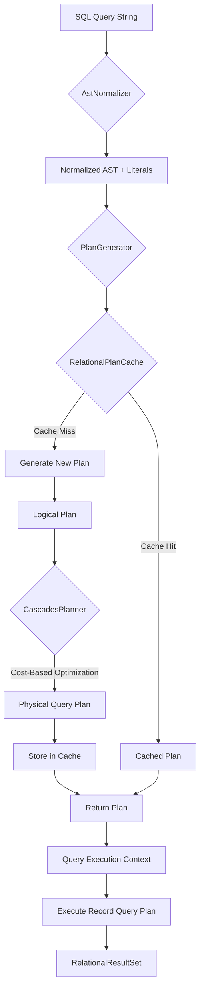

# FoundationDB 使い方ガイド

このドキュメントは、FoundationDB Record Layer開発において重要なFoundationDBの基本概念と使い方をまとめたものです。

## 目次

### Part 1: FoundationDB基礎
- [FoundationDBとは](#foundationdbとは)
- [コアアーキテクチャ](#コアアーキテクチャ)
- [標準搭載レイヤー](#標準搭載レイヤー)
- [ストレージエンジン](#ストレージエンジン)
- [データモデリングパターン](#データモデリングパターン)
- [トランザクション制限](#トランザクション制限)
- [エラーハンドリングとリトライ](#エラーハンドリングとリトライ)
- [マルチテナンシー](#マルチテナンシー)
- [パフォーマンスチューニング](#パフォーマンスチューニング)
- [バックアップとリストア](#バックアップとリストア)
- [Record Layerとの関係](#record-layerとの関係)

### Part 2: FoundationDB Record Layer（Java版）リファレンス
- [Record Layerとは](#record-layerとは)
- [アーキテクチャ](#アーキテクチャ)
- [FDBRecordStore](#fdbrecordstore)
- [FDBRecordContext](#fdbrecordcontext)
- [RecordMetaDataとスキーマ定義](#recordmetadataとスキーマ定義)
- [インデックスシステム](#インデックスシステム)
- [クエリシステム](#クエリシステム)
- [スキーマ進化とマイグレーション](#スキーマ進化とマイグレーション)
- [ベストプラクティス](#ベストプラクティス)
- [このプロジェクト（Swift版）との比較](#このプロジェクトswift版との比較)

---

## FoundationDBとは

FoundationDBは**分散トランザクショナルKey-Valueストア**で、以下の特徴を持ちます：

- **ACID保証**: 完全なトランザクション保証
- **順序付きKey-Value**: キーは辞書順でソートされる
- **楽観的並行性制御 (OCC)**: コミット時に競合検出
- **MVCC (Multi-Version Concurrency Control)**: バージョン管理による分離
- **分散アーキテクチャ**: 水平スケーラブル
- **Layer Concept**: Key-Value上に高レベルの抽象化を構築

---

## コアアーキテクチャ

### 主要コンポーネント

FoundationDBはプロセス・ロールモデルを採用しており、Workerプロセスが様々な論理ロールをホストします。

```
┌─────────────────────────────────────────────────────────┐
│                     Client Application                   │
└────────────────────────┬────────────────────────────────┘
                         │
        ┌────────────────┼────────────────┐
        ▼                ▼                ▼
   ┌─────────┐    ┌──────────┐    ┌──────────┐
   │   GRV   │    │  Commit  │    │ Storage  │
   │  Proxy  │    │  Proxy   │    │  Server  │
   └─────────┘    └──────────┘    └──────────┘
        │                │                │
        ▼                ▼                ▼
   ┌─────────────────────────────────────────┐
   │           Cluster Controller            │
   │         Master / Data Distributor        │
   │         Resolver / Ratekeeper           │
   └─────────────────────────────────────────┘
                         │
                         ▼
              ┌──────────────────┐
              │ Transaction Log  │
              │     (TLog)       │
              └──────────────────┘
```

#### コンポーネントの役割

| コンポーネント | 役割 |
|--------------|------|
| **Cluster Controller** | クラスタの健全性監視とロール割り当て |
| **Master** | トランザクション処理の調整、バージョン管理、リカバリ管理 |
| **Commit Proxy** | クライアントのコミットリクエスト処理、競合検出 |
| **GRV Proxy** | クライアントに読み取りバージョン（Get Read Version）を提供 |
| **Resolver** | トランザクション間の競合検出（読み書きレンジの競合チェック） |
| **Transaction Log (TLog)** | コミット済みトランザクションの永続化（Storage Serverへ転送前） |
| **Storage Server** | データの保存と提供（MVCC使用、バージョン管理されたKey-Value） |
| **Data Distributor** | Storage Server間のデータ分散とロードバランシング |
| **Ratekeeper** | トランザクションレート制御、システム過負荷防止 |

### トランザクション処理フロー

#### 読み取りトランザクション
1. クライアントがGRV Proxyから読み取りバージョンを取得
2. Storage Serverから直接データを読み取り
3. ReadYourWritesレイヤーが同一トランザクション内の書き込みを追跡

#### snapshotパラメータの設計思想

**FoundationDBにおけるsnapshot読み取り**:

| パラメータ | 動作 | 用途 |
|-----------|------|------|
| `snapshot: true` | **スナップショット読み取り**<br>・競合検知なし (conflict detection disabled)<br>・他のトランザクションの変更を検知しない<br>・読み取り専用操作に最適 | **SnapshotCursor**<br>トランザクション外の単発読み取り |
| `snapshot: false` | **Serializable読み取り**<br>・競合検知あり (conflict detection enabled)<br>・Read-Your-Writes保証<br>・Serializable isolation<br>・競合があればコミット時にエラー | **TransactionCursor**<br>明示的なトランザクション内の読み取り |

**このプロジェクトにおける実装方針**:

```swift
// TransactionCursor: トランザクション内 → snapshot: false
try await context.transaction { transaction in
    let cursor = try await transaction.fetch(query)
    // ← この読み取りは snapshot: false を使用
    // ・同一トランザクション内の書き込みが見える
    // ・他のトランザクションとの競合を検知
    // ・Serializable isolation保証

    for try await record in cursor {
        // トランザクション内での変更が反映される
    }
}

// SnapshotCursor: トランザクション外 → snapshot: true
let cursor = try await context.fetch(query)
// ← この読み取りは snapshot: true を使用
// ・読み取り専用
// ・競合検知不要
// ・パフォーマンス最適
for try await record in cursor {
    // スナップショット時点のデータを読み取る
}
```

**設計の根拠**:
1. **TransactionCursor**は明示的なトランザクション内で使用されるため、Serializable isolationが必要
2. **SnapshotCursor**は単発の読み取り専用操作なので、競合検知は不要
3. この設計により、正しいトランザクション動作と最適なパフォーマンスを両立

#### 書き込みトランザクション


---

## 標準搭載レイヤー

FoundationDBには、データモデリングを容易にする3つの重要な標準レイヤーが搭載されています。

### 1. Tuple Layer

**目的**: 様々なデータ型をバイト列にエンコードし、順序を保証

**特徴**:
- すべての公式言語バインディングで利用可能
- エンコード後も**自然なソート順を保持**
- 異なる言語間でのデータ互換性
- Range読み取りに最適化

**使用例**:
```python
# 州と郡のタプル
key = fdb.tuple.pack(('California', 'Los Angeles'))

# Range読み取り: カリフォルニアの全郡を取得
begin = fdb.tuple.pack(('California',))
end = fdb.tuple.pack(('California', '\xFF'))
for key, value in tr.get_range(begin, end):
    state, county = fdb.tuple.unpack(key)
```

**Swiftでの実装**:
```swift
// Tuple encoding (現在のプロジェクトで使用)
let key = Tuple("California", "Los Angeles")
let packed = key.pack()  // バイト列に変換

// Range読み取り
let prefix = Tuple("California")
let range = prefix.range()
```

### 2. Subspace Layer

**目的**: グローバルキー空間内で名前空間を提供

**特徴**:
- Tuple Layerを使用して実装
- プレフィックスを自動的に追加/削除
- 論理的なデータ分離
- ネストしたSubspaceの作成が可能

**ベストプラクティス**: アプリケーションは最低1つのSubspaceを使用すべき

**使用例**:
```python
# Subspaceの作成
app_subspace = Subspace(('myapp',))

# ネストしたSubspace
user_subspace = app_subspace['users']
order_subspace = app_subspace['orders']

# キーの自動プレフィックス付与
key = user_subspace.pack((user_id,))
# 実際のキー: ('myapp', 'users', user_id)
```

**Swiftでの実装**:
```swift
// 現在のプロジェクトで使用
let recordStore = RecordStore<RecordTypeUnion>(
    database: database,
    subspace: Subspace(rootPrefix: "my-app"),  // Subspace使用
    metaData: metaData,
    serializer: ProtobufRecordSerializer<RecordTypeUnion>()
)
```

### 3. Directory Layer

**目的**: 階層的なパス管理（ファイルシステムに類似）

**特徴**:
- Subspaceの上に構築
- パスを**短いプレフィックス**にマッピング（間接参照レベル）
- ディレクトリの移動（リネーム）が効率的（物理プレフィックスは変更されない）
- メタデータ用の`nodeSubspace`（デフォルト: `\xFE`）
- データ用の`contentSubspace`（デフォルト: プレフィックスなし）

**主な操作**:

| 操作 | 説明 |
|------|------|
| `createOrOpen(path)` | ディレクトリを開く（なければ作成） |
| `create(path)` | 新規ディレクトリ作成 |
| `open(path)` | 既存ディレクトリを開く |
| `move(oldPath, newPath)` | ディレクトリ移動 |
| `remove(path)` | ディレクトリとその内容を削除 |
| `exists(path)` | ディレクトリの存在確認 |

**使用例（Java）**:
```java
// ディレクトリの作成
DirectorySubspace schedulingDir =
    DirectoryLayer.getDefault()
        .createOrOpen(db, Arrays.asList("scheduling"))
        .get();

// サブディレクトリ
DirectorySubspace courseDir = schedulingDir.createOrOpen(db,
    Arrays.asList("class")).get();
DirectorySubspace attendDir = schedulingDir.createOrOpen(db,
    Arrays.asList("attends")).get();

// キーの使用
tr.set(courseDir.pack(Tuple.from("CS101")),
       Tuple.from(100).pack());
```

**Python例**:
```python
# ディレクトリの作成
scheduling = fdb.directory.create_or_open(db, ('scheduling',))

# サブスペースの取得
course = scheduling['class']
attends = scheduling['attends']

# データの保存
tr[course.pack(('CS101',))] = fdb.tuple.pack((100,))
```

### Directory Partitions

- 階層構造内の全ディレクトリが共通プレフィックスを共有
- ディレクトリとその子孫に対する単一のRange読み取りが必要な場合に有用
- 作成方法: `layer='partition'`パラメータを指定

**注意点**:
- プレフィックスが長くなる
- 異なるパーティション間でのディレクトリ移動不可

---

## ストレージエンジン

FoundationDBは複数のストレージエンジンをサポートしており、`fdbcli`で変更可能です。

### サポートされているエンジン

| エンジン | 説明 | 用途 |
|---------|------|------|
| **memory** | 全データをメモリに保持、ログをディスクに書き込み | 小規模DB（デフォルト1GBまで）、開発環境 |
| **memory-radixtree** | Radix treeを使用したメモリベースエンジン | 特殊用途 |
| **ssd** (ssd-1, ssd-2) | B-tree構造、SSD最適化（SQLiteベース） | 大規模データセット |
| **ssd-redwood-v1** | 改良版B-tree、SSD最適化 | **推奨**: 高スループット、低書き込み増幅 |
| **ssd-rocksdb-v1** | LSM-tree構造、圧縮とコンパクション | 書き込み集約型ワークロード |
| **ssd-sharded-rocksdb** | シャード化されたRocksDB | 大規模・高スループット |

### エンジンの比較

#### memory
- **メリット**: 高速読み取り、順次書き込み性能が良いディスクに適合
- **デメリット**: メモリ容量制限（1GB/プロセス）
- **適用**: 小規模DB、HDDなど弱いI/Oサブシステム

#### ssd (B-tree)
- **メリット**: 大規模データセット対応、SSDで高性能
- **デメリット**: 削除後の空間回復は遅延実行
- **適用**: 一般的な本番環境

#### ssd-redwood-v1（推奨）
- **メリット**:
  - ssdエンジンより高スループット
  - 書き込み増幅が低い
  - B-tree構造でSSD最適化
- **デメリット**: FDB 7.0.0以降が必要
- **適用**: 本番環境（最新の推奨エンジン）

#### ssd-rocksdb-v1
- **メリット**: LSM-tree、圧縮、コンパクション
- **デメリット**: 書き込み増幅が高い場合がある
- **適用**: 書き込み集約型、圧縮が重要な場合

### エンジンの変更

```bash
# fdbcliで変更
$ fdbcli
fdb> configure ssd-redwood-v1
```

### Versioned BTree

`ssd`と`ssd-redwood-v1`エンジンで使用されるB-tree実装：
- ディスク上にデータを保存
- SSDに最適化
- ページベースの構造（`BTreePage`）
- バージョン管理機能（MVCC対応）
- DeltaTree2でレコード管理

---

## データモデリングパターン

FoundationDBの基本データモデルは**順序付きKey-Valueストア**です。効率的なデータモデリングには、Tuple、Subspace、Directoryを活用します。

### 基本原則

1. **キーでRange読み取りを構造化**: 頻繁にアクセスするデータをRange読み取りで効率的に取得
2. **Tupleでキーを構成**: 自然なソート順を活用
3. **Subspaceで論理分離**: 異なるデータカテゴリを分離
4. **インデックスで複数のアクセスパターン**: 同じデータに対する異なるクエリパスを提供

### パターン1: シンプルインデックス

プライマリデータに対して、属性ベースのインデックスを作成します。

**例: ユーザーをZIPコードでインデックス**

```java
// プライマリデータ: (main, ID) = (name, zipcode)
public static void setUser(TransactionContext tcx,
                           final String ID,
                           final String name,
                           final String zipcode) {
    tcx.run(tr -> {
        // プライマリデータ
        tr.set(main.pack(Tuple.from(ID)),
               Tuple.from(name, zipcode).pack());

        // インデックス: (index, zipcode, ID) = ''
        tr.set(index.pack(Tuple.from(zipcode, ID)),
               Tuple.from().pack());

        return null;
    });
}

// ZIPコードでユーザーIDを検索
public static ArrayList<String> getUserIDsInRegion(
    TransactionContext tcx, final String zipcode) {
    return tcx.run(tr -> {
        ArrayList<String> IDs = new ArrayList<String>();

        // Range読み取り: (index, zipcode, *)
        for(KeyValue kv : tr.getRange(
            index.subspace(Tuple.from(zipcode)).range())) {
            // キーからIDを抽出
            IDs.add(index.unpack(kv.getKey()).getString(1));
        }
        return IDs;
    });
}
```

**重要**: プライマリデータとインデックスの更新は**同一トランザクション内**で行い、一貫性を保証します。

### パターン2: カバリングインデックス

インデックスから直接レコード全体を取得したい場合、インデックスキーまたは値にすべてのデータを含めます。

```java
// カバリングインデックス: (index, zipcode, ID) = (name, otherData)
tr.set(index.pack(Tuple.from(zipcode, ID)),
       Tuple.from(name, otherData).pack());

// インデックスから直接データ取得（プライマリデータへのアクセス不要）
for(KeyValue kv : tr.getRange(
    index.subspace(Tuple.from(zipcode)).range())) {
    Tuple data = Tuple.fromBytes(kv.getValue());
    String name = data.getString(0);
    // ... 他のデータ
}
```

**トレードオフ**:
- **メリット**: 読み取りが高速（1回のRange読み取りで完結）
- **デメリット**: ストレージ容量増加（データの重複）

### パターン3: テーブルインデックス（行指向・列指向）

表形式データで、行と列の両方向からアクセスしたい場合：

```python
# 行インデックス: (rowIndex, row, column) = value
# 列インデックス: (colIndex, column, row) = value

@fdb.transactional
def set_cell(tr, row, column, value):
    # 両方のインデックスを更新
    tr[row_index.pack((row, column))] = value
    tr[col_index.pack((column, row))] = value

# 行の取得
@fdb.transactional
def get_row(tr, row):
    result = {}
    for k, v in tr[row_index.pack((row,)) :
                   row_index.pack((row, '\xFF'))]:
        _, col = row_index.unpack(k)
        result[col] = v
    return result

# 列の取得
@fdb.transactional
def get_column(tr, column):
    result = {}
    for k, v in tr[col_index.pack((column,)) :
                   col_index.pack((column, '\xFF'))]:
        _, row = col_index.unpack(k)
        result[row] = v
    return result
```

### パターン4: 複合インデックス

複数の属性に基づいてソートやフィルタリングを行う場合：

```swift
// 例: 都市と年齢で検索
// インデックスキー: (index, city, age, userID) = ''

// 特定の都市で年齢範囲を検索
let beginKey = indexSubspace.pack(Tuple("Tokyo", 18))
let endKey = indexSubspace.pack(Tuple("Tokyo", 65))

for try await kv in transaction.getRange(begin: beginKey, end: endKey) {
    let tuple = try Tuple(from: indexSubspace.unpack(kv.key))
    let userID = tuple[2]  // 3番目の要素
    // ...
}
```

### Record Layerでの実装例

このプロジェクトでは、これらのパターンを高レベルAPIとして実装しています：

```swift
// Value Index（シンプルインデックス）
let emailIndex = Index(
    name: "user_by_email",
    type: .value,
    rootExpression: FieldKeyExpression(fieldName: "email")
)

// Compound Index（複合インデックス）
let cityAgeIndex = Index(
    name: "user_by_city_age",
    type: .value,
    rootExpression: ConcatenateKeyExpression(children: [
        FieldKeyExpression(fieldName: "city"),
        FieldKeyExpression(fieldName: "age")
    ])
)

// Count Index（集約インデックス）
let cityCountIndex = Index(
    name: "user_count_by_city",
    type: .count,
    rootExpression: FieldKeyExpression(fieldName: "city")
)
```

---

## トランザクション制限

FoundationDBには、パフォーマンスと一貫性を保証するための制限があります。

### サイズ制限

| 項目 | 制限 | 推奨 | 設定可能 |
|-----|------|------|---------|
| **キーサイズ** | 最大 10 KB | 32バイト以下 | ❌ |
| **値サイズ** | 最大 100 KB | 10 KB以下 | ❌ |
| **トランザクションサイズ** | デフォルト 10 MB | 用途に応じて調整 | ✅ |

**トランザクションサイズ**には以下が含まれます：
- すべての書き込みキー・値のサイズ
- すべてのクリアされたキーレンジ
- すべての読み取り・書き込み競合レンジ

#### トランザクションサイズ制限の設定

```python
# トランザクションレベル
@fdb.transactional
def large_operation(tr):
    tr.options.set_size_limit(50_000_000)  # 50 MB
    # ...

# データベースレベル（すべてのトランザクションのデフォルト）
db.options.set_transaction_size_limit(50_000_000)
```

```java
// トランザクションレベル
tr.options().setSizeLimit(50_000_000);

// データベースレベル
db.options().setTransactionSizeLimit(50_000_000);
```

**エラー**:
- 制限値が小さすぎる（32バイト未満）または大きすぎる → `invalid_option_value` (2006)
- トランザクションが制限超過 → `transaction_too_large` (2101)

### タイムアウト制限

| 項目 | デフォルト | 説明 |
|-----|-----------|------|
| **トランザクション実行時間** | 5秒まで | 5秒超過で`transaction_too_old` (1007) |
| **タイムアウト設定** | なし（無限リトライ） | 推奨: 設定する |

#### タイムアウトの設定

```python
# トランザクションレベル
@fdb.transactional
def timed_operation(tr):
    tr.options.set_timeout(3000)  # 3秒（ミリ秒）
    # ...

# データベースレベル
db.options.set_transaction_timeout(60000)  # 60秒
```

```java
// トランザクションレベル
tr.options().setTimeout(3000);  // 3秒

// データベースレベル
db.options().setTransactionTimeout(60000);  // 60秒
```

**注意**:
- タイムアウト = 0 → すべてのタイムアウトを無効化
- データベースとトランザクションの両方で設定した場合、トランザクション設定が優先

**エラー**:
- タイムアウト発生 → `transaction_timed_out` (1031)
- 5秒超過 → `transaction_too_old` (1007)

### リトライ制限

デフォルトでは、トランザクションは無限にリトライされます。本番環境では制限を設定すべきです。

```python
# リトライ回数制限
@fdb.transactional
def limited_retries(tr):
    tr.options.set_retry_limit(5)  # 最大5回リトライ
    # ...

# データベースレベル
db.options.set_transaction_retry_limit(10)
```

```java
tr.options().setRetryLimit(5);
db.options().setTransactionRetryLimit(10);
```

### Watchの制限

```python
# データベースごとのWatch制限（デフォルト: 10,000）
db.options.set_max_watches(100_000)  # 最大 1,000,000
```

**エラー**: 制限超過 → `too_many_watches`

### ベストプラクティス

1. **キーは小さく**: 32バイト以下を目指す（最大10KB）
2. **値は適度に**: 10KB以下を推奨（最大100KB）
3. **大きなデータは分割**: 100KBを超えるデータは複数のキーに分割
4. **タイムアウトを設定**: 本番環境では必ず設定
5. **リトライ制限を設定**: 無限リトライを避ける
6. **トランザクションは短く**: 5秒以内に完了するよう設計

---

## エラーハンドリングとリトライ

FoundationDBは楽観的並行性制御を使用するため、競合が発生した場合、トランザクションはコミット時に失敗し、クライアントでリトライする必要があります。

### 自動リトライパターン

各言語バインディングには、自動リトライ機能が組み込まれています。

#### Python

```python
import fdb

fdb.api_version(710)
db = fdb.open()

# @fdb.transactionalデコレータで自動リトライ
@fdb.transactional
def add_user(tr, user_id, name):
    tr[fdb.tuple.pack(('user', user_id))] = name

# 使用方法
add_user(db, 123, 'Alice')  # dbを渡すと自動的にトランザクション作成
```

**動作**:
1. トランザクション作成
2. 関数実行
3. コミット試行
4. エラー発生時、`tr.on_error(e)`を呼び出し
5. リトライ可能ならステップ2へ戻る
6. リトライ不可能ならエラーを投げる

#### Java

```java
import com.apple.foundationdb.*;

Database db = FDB.selectAPIVersion(710).open();

// db.run()で自動リトライ
private static void addUser(Database db, String userId, String name) {
    db.run(tr -> {
        tr.set(Tuple.from("user", userId).pack(),
               Tuple.from(name).pack());
        return null;
    });
}
```

#### Go

```go
import "github.com/apple/foundationdb/bindings/go/src/fdb"

db := fdb.MustOpenDefault()

// Transact()で自動リトライ
func addUser(db fdb.Database, userID string, name string) error {
    _, err := db.Transact(func(tr fdb.Transaction) (interface{}, error) {
        key := tuple.Tuple{"user", userID}
        tr.Set(key, []byte(name))
        return nil, nil
    })
    return err
}
```

#### Ruby

```ruby
require 'fdb'

FDB.api_version 710
db = FDB.open

# transactブロックで自動リトライ
def add_user(db, user_id, name)
  db.transact do |tr|
    tr[FDB::Tuple.pack(['user', user_id])] = name
  end
end
```

### トランザクションの合成

トランザクション関数は合成可能です。既存の`Transaction`オブジェクトを渡すことで、複数の操作を1つのトランザクションにまとめられます。

```python
@fdb.transactional
def signup(tr, student_id, class_name):
    key = fdb.tuple.pack(('attends', student_id, class_name))
    tr[key] = b''

@fdb.transactional
def drop(tr, student_id, class_name):
    key = fdb.tuple.pack(('attends', student_id, class_name))
    del tr[key]

@fdb.transactional
def switch_class(tr, student_id, old_class, new_class):
    # drop()とsignup()を同一トランザクション内で実行
    drop(tr, student_id, old_class)      # trを渡す
    signup(tr, student_id, new_class)    # trを渡す

# 使用
switch_class(db, 'student123', 'CS101', 'CS102')  # dbを渡すと新規トランザクション
```

### エラーの種類

#### リトライ可能なエラー

これらのエラーは`on_error()`を呼び出すことで自動的にリトライされます：

| エラー | コード | 説明 |
|--------|--------|------|
| `not_committed` | 1020 | トランザクションが競合によりコミットされなかった |
| `transaction_too_old` | 1007 | トランザクションが5秒を超えた |
| `future_version` | 1009 | 読み取りバージョンが未来すぎる |

#### リトライ不可能なエラー

これらのエラーは`on_error()`が再スローします：

| エラー | コード | 説明 |
|--------|--------|------|
| `transaction_timed_out` | 1031 | タイムアウト制限に達した |
| `operation_cancelled` | 1101 | 操作がキャンセルされた |
| `transaction_too_large` | 2101 | トランザクションサイズ制限超過 |

#### 特殊なエラー: commit_unknown_result

| エラー | コード | 説明 |
|--------|--------|------|
| `commit_unknown_result` | 1021 | コミットが成功したかどうか不明 |

**発生状況**:
- コミット中にクライアントが接続を失った
- FoundationDBコンポーネントが障害を起こした

**保証**:
- トランザクションはもはや実行中ではない（完了または中止）

**対処法**:
トランザクションが**冪等**であれば、安全にリトライできます。

### 冪等性の確保

冪等なトランザクションとは、複数回実行しても同じ結果になるトランザクションです。

#### 悪い例（非冪等）

```python
@fdb.transactional
def deposit_bad(tr, account_id, amount):
    # 問題: トランザクションが成功したかわからない場合、
    # 再実行すると重複入金される
    balance_key = fdb.tuple.pack(('account', account_id))
    tr.add(balance_key, struct.pack('<i', amount))
```

#### 良い例（冪等）

```python
@fdb.transactional
def deposit_good(tr, account_id, deposit_id, amount):
    # デポジットIDでユニーク性を保証
    deposit_key = fdb.tuple.pack(('account', account_id, 'deposit', deposit_id))

    # 既に処理済みかチェック
    if tr[deposit_key].present():
        return  # 既に成功済み

    # 処理を実行
    tr[deposit_key] = struct.pack('<i', amount)

    balance_key = fdb.tuple.pack(('account', account_id, 'balance'))
    tr.add(balance_key, struct.pack('<i', amount))
```

**ポイント**:
1. **ユニークIDを使用**: リトライループの外で生成
2. **完了チェック**: トランザクション内で副作用の完了をチェック
3. **冪等な操作**: 同じIDで複数回実行しても安全

### 手動リトライループ（参考）

通常は自動リトライを使いますが、手動ループの理解も重要です：

```python
import fdb

db = fdb.open()

def manual_retry_example(user_id, name):
    tr = db.create_transaction()
    committed = False

    while not committed:
        try:
            # 操作
            tr[fdb.tuple.pack(('user', user_id))] = name

            # コミット
            tr.commit().wait()
            committed = True

        except fdb.FDBError as e:
            # エラーハンドリング
            tr.on_error(e).wait()
            # on_error()はリトライ可能なら待機後に戻る
            # リトライ不可能ならエラーを再スロー
```

**C++/Flowでの実装（Record Layer内部）**:
```cpp
template<class Function>
ACTOR Future<Void> runTransaction(Database db, Function func) {
    state Transaction tr(db);
    loop {
        try {
            func(tr);
            wait(tr.commit());
            break;
        } catch (Error& e) {
            wait(tr.onError(e));
        }
    }
    return Void();
}
```

---

## マルチテナンシー

FoundationDBのマルチテナンシーシステムは、単一の物理データベースを複数の論理的に分離されたテナントサブスペースに分割します。

### 概要

**マルチテナンシーの仕組み**:
- 各テナントに一意の64ビットID
- IDから8バイトのプレフィックスを生成
- テナントコンテキスト内のすべてのキーに自動的にプレフィックスを付与
- 論理的なデータ分離を実現

### テナントのデータモデル

```
TenantMapEntry {
    TenantName: "tenant-abc"       // 人間が読める名前
    id: 123456789                   // 一意の64ビットID
    prefix: <8バイト>               // IDから派生したプレフィックス
    tenantGroup: "group-1"         // オプション: テナントグループ
    lockState: unlocked            // ロック状態
}
```

### テナントIDの構造（メタクラスタ環境）

```
64ビット テナントID
├─ 上位16ビット: メタクラスタID（最大65,536個のメタクラスタ）
└─ 下位48ビット: テナント固有ID（メタクラスタごとに最大281兆テナント）
```

### テナント操作

#### fdbcliコマンド

```bash
# テナントモード設定
fdb> configure tenant_mode=optional_experimental

# テナント作成
fdb> tenant create tenant-abc

# テナント一覧
fdb> tenant list

# テナント設定
fdb> tenant configure tenant-abc tenant_group=group-1

# テナント削除（空である必要がある）
fdb> tenant delete tenant-abc
```

#### プログラムでの使用（Python）

```python
# テナントを開く
tenant = db.open_tenant(b'tenant-abc')

# テナント内でトランザクション実行
@fdb.transactional
def tenant_operation(tr):
    # すべてのキーに自動的にテナントプレフィックスが付与される
    tr[b'user:123'] = b'Alice'
    # 実際のキー: <tenant-prefix> + b'user:123'

# 実行
tenant_operation(tenant)
```

### テナントモード

| モード | 説明 |
|--------|------|
| `disabled` | テナント作成・使用不可 |
| `optional_experimental` | テナント作成可能、トランザクションはテナント使用を選択可 |
| `required_experimental` | 通常のトランザクションはテナント必須（`RAW_ACCESS`でシステムキー空間にアクセス可能） |

### メタクラスタとの統合

メタクラスタ環境では：
- **管理クラスタ**: テナントとデータクラスタへの割り当てのメタデータを保存
- **データクラスタ**: 実際のテナントデータを保存

```
                    ┌──────────────────┐
                    │ Management       │
                    │ Cluster          │
                    │ - Tenant Metadata│
                    │ - Assignments    │
                    └────────┬─────────┘
                             │
              ┌──────────────┼──────────────┐
              ▼              ▼              ▼
        ┌──────────┐   ┌──────────┐   ┌──────────┐
        │ Data     │   │ Data     │   │ Data     │
        │ Cluster 1│   │ Cluster 2│   │ Cluster 3│
        └──────────┘   └──────────┘   └──────────┘
```

### 認証とアクセス制御

- **信頼クライアント**: すべてのテナントにアクセス可能
- **非信頼クライアント**: JSON Web Token (JWT)を使用してテナントスコープのアクセス

```cpp
// TenantInfo構造（内部実装）
struct TenantInfo {
    int64_t tenantId;
    StringRef prefix;
    bool trusted;
    bool tenantAuthorized;
};
```

### Record Layerでの活用

このプロジェクトでマルチテナンシーを活用する場合：

```swift
// テナントごとに異なるSubspaceを使用
let tenant1Store = RecordStore<RecordTypeUnion>(
    database: database,
    subspace: Subspace(rootPrefix: "tenant-1"),
    metaData: metaData,
    serializer: serializer
)

let tenant2Store = RecordStore<RecordTypeUnion>(
    database: database,
    subspace: Subspace(rootPrefix: "tenant-2"),
    metaData: metaData,
    serializer: serializer
)

// または、FoundationDBのテナント機能を直接使用
// (将来の実装で考慮)
```

---

## パフォーマンスチューニング

FoundationDBは**Knobs**システムを使用して、様々なパフォーマンスパラメータを調整できます。

### Knobsシステム

Knobsは以下の優先順位で適用されます：

1. **コマンドライン指定のKnobs**（最優先）
2. **個別設定クラスのオーバーライド**
3. **グローバル設定Knobs**
4. **デフォルト値**

### 動的Knobs

一部のKnobsは、プロセスの再起動なしで変更できます（動的Knobs）。

```bash
# fdbcliで動的Knobsを設定
fdb> setknob KNOB_NAME VALUE

# Knobの取得
fdb> getknob KNOB_NAME

# Knobのクリア
fdb> clearknob KNOB_NAME
```

### 主要なServer Knobs

#### データ分散

| Knob | 説明 | 用途 |
|------|------|------|
| `DD_SHARD_SIZE_GRANULARITY` | シャードサイズの粒度 | データ分散の細かさを調整 |
| `DD_MOVE_KEYS_PARALLELISM` | データ移動の並列度 | リバランス速度を調整 |
| `MAX_LARGE_SHARD_BYTES` | 大きなシャードの最大サイズ | シャード分割のしきい値 |

#### TLog（書き込みパフォーマンス）

| Knob | 説明 | 用途 |
|------|------|------|
| `TLOG_HARD_LIMIT_BYTES` | TLogのハードメモリ制限 | 書き込み集約型ワークロード |
| `TARGET_BYTES_PER_TLOG` | TLogあたりの目標バイト数 | TLogのスケーリング |
| `UPDATE_STORAGE_BYTE_LIMIT` | Storage更新のバイト制限 | Storage Serverへの更新スループット |

#### Storage Server（読み取りパフォーマンス）

| Knob | 説明 | 用途 |
|------|------|------|
| `STORAGE_SERVER_READ_CONCURRENCY` | 読み取り並列度 | 読み取り集約型ワークロード |
| `STORAGESERVER_READ_PRIORITIES` | 読み取り優先度設定 | 異なる読み取りタイプの優先順位 |

#### リソース管理

| Knob | 説明 | 用途 |
|------|------|------|
| `MIN_AVAILABLE_SPACE` | 最小利用可能ディスク容量 | ディスク容量管理 |
| `MIN_AVAILABLE_SPACE_RATIO` | 最小利用可能容量比率 | ディスク容量管理 |

#### スロットリング

| Knob | 説明 | 用途 |
|------|------|------|
| `HOT_SHARD_THROTTLING_ENABLED` | ホットシャードスロットリング | 個別ホットシャードの過負荷防止 |
| `GLOBAL_TAG_THROTTLING_LIMITING_THRESHOLD` | グローバルタグスロットリングしきい値 | タグ付きトランザクションの制御 |

### 主要なClient Knobs

#### トランザクション制限

| Knob | 説明 | デフォルト |
|------|------|-----------|
| `TRANSACTION_SIZE_LIMIT` | トランザクションサイズ制限 | 10 MB |
| `KEY_SIZE_LIMIT` | キーサイズ制限 | 10 KB |
| `VALUE_SIZE_LIMIT` | 値サイズ制限 | 100 KB |

#### リトライ遅延

| Knob | 説明 | 用途 |
|------|------|------|
| `WRONG_SHARD_SERVER_DELAY` | 誤ったシャードサーバー遅延 | クライアントリトライ |
| `FUTURE_VERSION_RETRY_DELAY` | 未来バージョンリトライ遅延 | クライアント応答性 |
| `GRV_ERROR_RETRY_DELAY` | GRVエラーリトライ遅延 | 読み取りバージョン取得リトライ |

### ワークロード別の最適化

#### 書き込み集約型ワークロード

```bash
# TLogメモリ制限を増やす
setknob TLOG_HARD_LIMIT_BYTES 8000000000  # 8GB

# Storage更新バイト制限を増やす
setknob UPDATE_STORAGE_BYTE_LIMIT 20000000  # 20MB
```

#### 読み取り集約型ワークロード

```bash
# Storage Server読み取り並列度を増やす
setknob STORAGE_SERVER_READ_CONCURRENCY 100

# Redwoodエンジン: Range Prefetchを有効化
setknob REDWOOD_KVSTORE_RANGE_PREFETCH 1
```

#### 大規模データセット

```bash
# シャードサイズを調整
setknob MAX_LARGE_SHARD_BYTES 1000000000  # 1GB

# データ分散並列度を増やす
setknob DD_MOVE_KEYS_PARALLELISM 10
```

#### 高並列性

```bash
# Commit/GRV Proxy接続数を増やす
setknob MAX_COMMIT_PROXY_CONNECTIONS 100
setknob MAX_GRV_PROXY_CONNECTIONS 100
```

### Flow Knobs（ロードバランシング）

| Knob | 説明 | 用途 |
|------|------|------|
| `LOAD_BALANCE_START_BACKOFF` | ロードバランスバックオフ開始 | リクエスト分散 |
| `LOAD_BALANCE_BACKOFF_RATE` | バックオフレート | ロードバランス調整 |
| `BASIC_LOAD_BALANCE_UPDATE_RATE` | 基本ロードバランス更新レート | 負荷情報更新頻度 |

### トレーシングとメトリクス

```bash
# トレーシングを有効化
setknob WRITE_TRACING_ENABLED 1

# サンプリングレート設定
setknob TRACING_SAMPLE_RATE 0.01  # 1%サンプリング

# メトリクス出力間隔
setknob METRICS_EMISSION_INTERVAL 10.0  # 10秒
```

### ベストプラクティス

1. **段階的に調整**: 1つずつKnobsを変更し、効果を測定
2. **監視**: メトリクスとトレーシングで効果を確認
3. **テスト**: 本番環境に適用する前にステージング環境でテスト
4. **ドキュメント化**: 変更したKnobsとその理由を記録
5. **デフォルトに戻す**: 効果がない場合はデフォルトに戻す

---

## バックアップとリストア

FoundationDBは、ポイントインタイムバックアップと災害復旧のための包括的なバックアップ・リストアシステムを提供します。

### バックアップシステムアーキテクチャ

```
┌─────────────────┐
│ Client App      │
└────────┬────────┘
         │
         ▼
┌─────────────────────────────┐
│ FileBackupAgent             │
│ DatabaseBackupAgent (DR)    │
└────────┬────────────────────┘
         │
    ┌────┴─────────────┐
    ▼                  ▼
┌─────────┐    ┌──────────────┐
│TaskBucket│    │FutureBucket  │
└────┬────┘    └──────────────┘
     │
     ▼
┌─────────────────────────────┐
│ IBackupContainer            │
│ - LocalDirectory            │
│ - S3BlobStore               │
│ - AzureBlobStore            │
└─────────────────────────────┘
```

### バックアップタイプ

#### 1. ファイルバックアップ

データをローカルディレクトリ、S3、Azureに保存します。

**開始**:
```bash
# fdbbackupコマンド
fdbbackup start -d file:///path/to/backup \
    -w  # 完了を待機

# S3へのバックアップ
fdbbackup start -d blobstore://s3-bucket/path?bucket=my-bucket \
    --aws-access-key-id=XXX \
    --aws-secret-access-key=YYY
```

**監視**:
```bash
# バックアップステータス確認
fdbbackup status

# 詳細情報
fdbbackup status -d file:///path/to/backup
```

**停止**:
```bash
fdbbackup abort
```

#### 2. データベース間バックアップ（DR）

別のFoundationDBクラスタへの継続的レプリケーション。ホットスタンバイを提供します。

```bash
# DR開始
fdbdr start -d "destination_cluster_file" -s "source_cluster_file"

# DRステータス
fdbdr status

# DR停止
fdbdr abort
```

### バックアップの内容

バックアップは以下で構成されます：

1. **スナップショットファイル**: 特定時点のキーレンジの完全コピー
2. **ログファイル**: スナップショット以降のミューテーション（変更）

### リストアプロセス

#### 基本リストア

```bash
# リストア開始
fdbrestore start -r file:///path/to/backup

# リストアステータス
fdbrestore status

# リストア待機
fdbrestore wait
```

#### 特定バージョンへのリストア

```bash
# 特定のタイムスタンプへリストア
fdbrestore start -r file:///path/to/backup \
    --timestamp "2024-01-15 10:30:00"

# 特定バージョンへリストア
fdbrestore start -r file:///path/to/backup \
    --version 1234567890
```

#### キープレフィックス変換

リストア時にキーのプレフィックスを追加・削除できます。データ移行に便利です。

```bash
# プレフィックスを追加
fdbrestore start -r file:///path/to/backup \
    --add-prefix "\x01\x02"

# プレフィックスを削除
fdbrestore start -r file:///path/to/backup \
    --remove-prefix "\x01\x02"

# キーレンジを指定
fdbrestore start -r file:///path/to/backup \
    --begin-key "user:" \
    --end-key "user;\xFF"
```

### プログラムでのバックアップ（Python）

```python
import fdb

fdb.api_version(710)
db = fdb.open()

# バックアップエージェントの作成（概念的な例）
# 実際にはfdbbackupコマンドラインツールを使用することを推奨

# バックアップ設定
backup_url = "file:///path/to/backup"

# バックアップ開始（内部API例）
# db.backup.start(backup_url, wait_for_complete=True)

# バックアップステータス確認
# status = db.backup.get_status()
```

### 差分バックアップ

初期スナップショット後、ミューテーションを継続的にキャプチャします。

**特徴**:
- 初期スナップショット + 継続的ミューテーションログ
- 任意のバージョンへのポイントインタイムリカバリ
- `StopWhenDone::False`で有効化

```bash
# 継続的バックアップ
fdbbackup start -d file:///path/to/backup --no-stop-when-done
```

### パーティションログ

大規模データベース・高書き込み負荷に対応するため、バックアップログをパーティション化できます。

**メリット**:
- 並列処理によるスケーラビリティ向上
- 書き込み帯域幅使用量を半減（FDB 6.3+）
- `BackupWorker`プロセスがTLogから直接ミューテーションをプル

**有効化**:
```bash
fdbbackup start -d file:///path/to/backup --partitioned-logs
```

### バックアップ・リストアのベストプラクティス

1. **定期的なバックアップ**: 自動化されたスケジュールでバックアップ
2. **リストアテスト**: 定期的にリストアをテストして検証
3. **差分バックアップの活用**: 継続的保護のため差分バックアップを使用
4. **オフサイトストレージ**: S3やAzureなどのリモートストレージを使用
5. **監視**: バックアップステータスを監視し、失敗時にアラート
6. **保持ポリシー**: 古いバックアップの保持期間を定義
7. **暗号化**: バックアップデータを暗号化（ストレージ側で設定）

### Record Layerでのバックアップ考慮事項

このRecord Layerを使用している場合：

```swift
// バックアップ前の考慮事項
// 1. インデックス構築中でないか確認
let indexState = try await recordStore.indexState(of: "index_name", context: context)
if indexState == .writeOnly {
    // インデックス構築完了まで待機
}

// 2. オンラインインデックスビルダーの進行状況を確認
let (scanned, batches, progress) = try await indexer.getProgress()
if progress < 1.0 {
    // インデックス構築完了まで待機
}

// 3. バックアップ実行（fdbbackupコマンドを使用）
// $ fdbbackup start -d file:///path/to/backup

// リストア後の考慮事項
// 1. メタデータの整合性確認
// 2. インデックス状態の確認
// 3. 必要に応じてインデックス再構築
```

---

## Record Layerとの関係

このプロジェクトのRecord Layerは、FoundationDBの標準レイヤーの上に構築された**高レベルの抽象化レイヤー**です。

### レイヤー構造

```
┌────────────────────────────────────────────────┐
│   Application Layer (あなたのアプリ)              │
└───────────────────┬────────────────────────────┘
                    │
┌───────────────────▼────────────────────────────┐
│   Record Layer (このプロジェクト)                 │
│   - Protobufスキーマ                            │
│   - セカンダリインデックス                         │
│   - クエリプランナー & オプティマイザー              │
│   - オンラインインデックスビルダー                  │
│   - RangeSet (進行状況追跡)                      │
│   - IndexStateManager                          │
└───────────────────┬────────────────────────────┘
                    │
┌───────────────────▼────────────────────────────┐
│   FoundationDB標準レイヤー                        │
│   - Tuple Layer (エンコーディング)                │
│   - Subspace Layer (名前空間)                   │
│   - Directory Layer (階層管理)                  │
└───────────────────┬────────────────────────────┘
                    │
┌───────────────────▼────────────────────────────┐
│   FoundationDB Native API                      │
│   - Transaction                                │
│   - ReadYourWrites                             │
│   - Key-Value操作                              │
└───────────────────┬────────────────────────────┘
                    │
┌───────────────────▼────────────────────────────┐
│   FoundationDBクラスタ                           │
│   - 分散トランザクション処理                      │
│   - ストレージエンジン (ssd-redwood-v1など)       │
│   - ACID保証                                   │
└────────────────────────────────────────────────┘
```

### FoundationDB標準レイヤーの使用箇所

#### Tuple Layer

Record Layerでは、キーのエンコーディングにTupleを使用：

```swift
// プライマリキーのエンコーディング
let primaryKey = Tuple(userID)  // 例: Tuple(123)
let packedKey = recordSubspace.pack(primaryKey)

// インデックスキーのエンコーディング
let indexKey = Tuple(email, userID)  // 例: Tuple("alice@example.com", 123)
let packedIndexKey = indexSubspace.pack(indexKey)
```

**対応ファイル**:
- `Sources/FDBRecordLayer/Core/Tuple.swift`
- `Sources/FDBRecordLayer/Core/TupleEncoding.swift`

#### Subspace Layer

Record Layerでは、Subspaceを使用してデータを論理的に分離：

```swift
// RecordStoreのSubspace構造
let rootSubspace = Subspace(rootPrefix: "my-app")

// 内部的なサブスペース
let recordSubspace = rootSubspace["records"]
let indexSubspace = rootSubspace["indexes"]
let metadataSubspace = rootSubspace["metadata"]

// インデックスごとのサブスペース
let emailIndexSubspace = indexSubspace["user_by_email"]
let cityAgeIndexSubspace = indexSubspace["user_by_city_age"]
```

**対応ファイル**:
- `Sources/FDBRecordLayer/Core/Subspace.swift`

#### Directory Layer（将来の拡張）

現在は直接使用していませんが、将来的にマルチテナント対応で活用可能：

```swift
// 将来の実装例
let directoryLayer = DirectoryLayer()
let tenantDir = try await directoryLayer.createOrOpen(
    db,
    path: ["tenants", "tenant-abc"]
)

let recordStore = RecordStore<RecordTypeUnion>(
    database: database,
    subspace: tenantDir,  // Directoryから取得したSubspace
    metaData: metaData,
    serializer: serializer
)
```

### Record Layerの付加価値

FoundationDB標準レイヤーに対して、Record Layerは以下を提供：

1. **スキーマ定義**:
   - Protobufベースの型安全なスキーマ
   - フィールド定義と検証
   - RecordMetaData管理

2. **セカンダリインデックス**:
   - Value Index（B-tree）
   - Count Index（集約）
   - Sum Index（集約）
   - 自動インデックスメンテナンス

3. **インデックスライフサイクル**:
   - 3状態管理（disabled → writeOnly → readable）
   - オンラインインデックス構築
   - バッチトランザクション処理
   - 再開可能な操作（RangeSet使用）

4. **クエリ最適化**:
   - コストベースのクエリプランナー
   - 統計情報収集（ヒストグラム）
   - クエリリライト（DNF変換、NOT押し下げ）
   - プランキャッシング

5. **高レベルAPI**:
   - `saveRecord()`, `loadRecord()`, `deleteRecord()`
   - `executeQuery()`
   - 型安全なSwift API

### FoundationDBの制約とRecord Layerの対処

| FoundationDB制約 | Record Layerの対処 |
|-----------------|-------------------|
| キーサイズ最大10KB | プライマリキーは簡潔に設計（Tuple使用） |
| 値サイズ最大100KB | 大きなレコードは分割可能（将来実装） |
| トランザクション5秒制限 | バッチ処理（OnlineIndexer） |
| トランザクションサイズ10MB | バッチサイズ調整（`batchSize`パラメータ） |
| 楽観的並行性制御 | 自動リトライ（`withRecordContext`） |

### 開発時の考慮事項

Record Layer開発時は、FoundationDBの以下の特性を意識：

1. **順序付きKey-Value**: インデックスキーの設計時、ソート順を考慮
2. **Range読み取り**: プレフィックススキャンを活用したクエリ実装
3. **トランザクション制限**: 大規模操作はバッチ化
4. **ACID保証**: インデックス更新は必ずレコード更新と同一トランザクション
5. **MVCC**: 読み取りバージョンと書き込みバージョンの分離

### まとめ

Record Layerは、FoundationDBの強力な基盤の上に：
- **RDBMSライクな機能**（スキーマ、インデックス、クエリ）
- **NoSQLの柔軟性**（スキーマ進化、水平スケーラビリティ）
- **分散システムの利点**（ACID保証、高可用性）

を統合した、モダンなデータベース抽象化レイヤーです。

---

## FoundationDB Record Layer（Java版）リファレンス

このセクションでは、FoundationDBの公式Record Layer（Java実装）について説明します。このプロジェクト（Swift実装）の設計参考として重要です。

### Record Layerとは

FoundationDB Record Layerは、FoundationDBの上に構築された**構造化レコード指向ストア**で、以下の機能を提供します：

- **構造化型**: Protobufメッセージによるレコード定義
- **リッチなインデックス**: Value、Rank、Aggregate、Lucene（全文検索）など
- **複雑な型**: リスト、ネストされたレコードのサポート
- **クエリAPI**: スキャン、フィルタリング、ソート機能
- **自動クエリプランニング**: インデックス選択とコスト最適化
- **スキーマ進化**: 複数のRecordStoreで共有・進化するスキーマ
- **軽量・拡張可能**: 大規模分散環境向け、カスタムインデックスタイプのサポート

### アーキテクチャ



### FDBRecordStore

**中核コンポーネント**: レコードの保存・取得、インデックス管理、クエリ実行の主要API

**特徴**:
- 特定のSubspaceに関連付け
- トランザクションコンテキスト内で動作
- `Subspace`、`RecordMetaData`、`FDBRecordContext`を組み合わせ
- すべてのデータ（インデックス含む）を指定Subspace内に永続化

**基本操作**（Java）:
```java
// RecordStoreの作成
FDBRecordStore recordStore = FDBRecordStore.newBuilder()
    .setContext(context)
    .setSubspace(subspace)
    .setMetaDataProvider(metaDataProvider)
    .createOrOpen();

// レコードの保存
MyRecord record = MyRecord.newBuilder()
    .setRecNo(1)
    .setStrValue("test")
    .build();
recordStore.saveRecord(record);

// レコードの読み取り
FDBStoredRecord<Message> stored =
    recordStore.loadRecord(Tuple.from(1L));

// レコードの削除
recordStore.deleteRecord(Tuple.from(1L));
```

### FDBRecordContext

**トランザクション管理**: FoundationDBトランザクションをラップし、構造化されたアプローチを提供

#### トランザクションライフサイクル



#### トランザクション設定（Java）

```java
// コンテキストの作成と設定
FDBRecordContext context = database.openContext(
    FDBRecordContextConfig.newBuilder()
        .setPriority(FDBTransactionPriority.BATCH)
        .setTransactionTimeoutMillis(5000)
        .setWeakReadSemantics(new FDBDatabase.WeakReadSemantics(
            0L,      // staleness bound
            100L,    // min version
            false    // cache on read
        ))
        .setLogTransaction(true)
        .build()
);

// コミット前チェックの追加
context.addCommitCheck(new CommitCheckAsync() {
    @Override
    public CompletableFuture<Void> checkAsync(FDBRecordContext context) {
        // カスタム検証ロジック
        return CompletableFuture.completedFuture(null);
    }
});

// トランザクションのコミット
context.commitAsync().join();

// または自動リトライ付き実行
database.runAsync(context -> {
    FDBRecordStore store = // ... open store
    store.saveRecord(record);
    return CompletableFuture.completedFuture(null);
}).join();
```

### RecordMetaDataとスキーマ定義

#### Protobufスキーマ定義

```protobuf
syntax = "proto3";

message MyRecord {
    option (com.apple.foundationdb.record.record).usage = RECORD;

    int64 rec_no = 1 [(com.apple.foundationdb.record.field).primary_key = true];
    string str_value = 2 [(com.apple.foundationdb.record.field).index = {}];
    int32 num_value = 3;
}

message RecordTypeUnion {
    option (com.apple.foundationdb.record.record).usage = UNION;

    oneof _record {
        MyRecord my_record = 1;
    }
}
```

#### プログラムによるメタデータ構築

```java
// FileDescriptorからメタデータを構築
RecordMetaData metaData = RecordMetaData.newBuilder()
    .setRecords(myProto.getDescriptor())
    .build();

// または、プログラムでインデックスを追加
RecordMetaDataBuilder metaDataBuilder = RecordMetaData.newBuilder()
    .setRecords(myProto.getDescriptor());

// 単一フィールドインデックス
metaDataBuilder.addIndex("MyRecord", "MyRecord$str_value",
    Key.Expressions.field("str_value"));

// 複合インデックス（ユニーク制約付き）
metaDataBuilder.addIndex("MyRecord",
    new Index("MyRecord$parent&str",
        Key.Expressions.concatenateFields("parent_rec_no", "str_value"),
        Index.EMPTY_VALUE,
        IndexTypes.VALUE,
        IndexOptions.UNIQUE_OPTIONS));

// マルチタイプインデックス
metaDataBuilder.addMultiTypeIndex(
    Arrays.asList(
        metaDataBuilder.getRecordType("MyRecord"),
        metaDataBuilder.getRecordType("OtherRecord")
    ),
    new Index("all$rec_nos", Key.Expressions.field("rec_no")));

RecordMetaData metaData = metaDataBuilder.getRecordMetaData();
```

### インデックスシステム

#### インデックスタイプ

| タイプ | 説明 | 用途 |
|--------|------|------|
| **VALUE** | 標準B-treeインデックス | 基本的なルックアップとRange検索 |
| **RANK** | ランキング維持（Skip-list） | リーダーボード、順序付きリスト |
| **COUNT** | レコード数カウント | グループごとの集約 |
| **SUM** | 値の合計 | 数値フィールドの集約 |
| **TEXT (Lucene)** | 全文検索 | 複雑なテキストクエリ |
| **VERSION** | バージョン管理データ | 時系列データ |
| **SPATIAL** | 空間インデックス | 地理データ |

#### VALUE インデックス

```java
// 単一フィールドインデックス
Index emailIndex = new Index(
    "user_by_email",
    Key.Expressions.field("email"),
    IndexTypes.VALUE
);

// 複合インデックス
Index cityAgeIndex = new Index(
    "user_by_city_age",
    Key.Expressions.concatenateFields("city", "age"),
    IndexTypes.VALUE
);

// ユニークインデックス
Index uniqueEmailIndex = new Index(
    "user_by_email_unique",
    Key.Expressions.field("email"),
    IndexTypes.VALUE,
    IndexOptions.UNIQUE_OPTIONS
);
```

#### RANK インデックス（リーダーボード）

Rankインデックスは、`RankedSet`（永続的Skip-list）を使用して効率的に順序付きリストを維持します。

**基本操作**:
- **rank**: 値の順位を取得
- **select/getNth**: 順位から値を取得

```java
// Rankインデックス定義
Index scoreRankIndex = new Index(
    "game_score_rank",
    Key.Expressions.field("score"),
    IndexTypes.RANK
);

// レコードのランクを取得
RecordFunction<Long> rankFunction =
    Query.rank(Key.Expressions.field("score"));
Long rank = recordStore.evaluateRecordFunction(rankFunction, record)
    .join();

// 特定ランクのレコードを検索
RecordQuery query = RecordQuery.newBuilder()
    .setRecordType("GameScore")
    .setFilter(Query.rank("score").equalsValue(10L))  // 10位
    .build();

// スコアから順位を取得（集約関数）
IndexAggregateFunction rankForScore =
    IndexFunctionHelper.rankForScore("game_score_rank");
Long rank = recordStore.evaluateAggregateFunction(
    Collections.singletonList("GameScore"),
    rankForScore,
    Tuple.from("game-1", 750),  // group key + score
    IsolationLevel.SERIALIZABLE
).join();
```

#### 時間窓リーダーボード

```java
// 時間窓リーダーボードインデックス
Index leaderboardIndex = new Index(
    "time_window_leaderboard",
    Key.Expressions.concatenateFields("game_id", "timestamp", "score"),
    IndexTypes.TIME_WINDOW_LEADERBOARD,
    Map.of(
        IndexOptions.TIME_WINDOW_LEADERBOARD_WINDOW_SIZE, "86400",  // 1日
        IndexOptions.TIME_WINDOW_LEADERBOARD_TYPE, "all_time,-1"
    )
);

// 時間窓内のランクを取得
RecordFunction<Long> timeWindowRank =
    Query.timeWindowRank(
        TimeWindowLeaderboard.ALL_TIME_LEADERBOARD_TYPE,
        -1  // high score first
    );

// 特定時間窓でスキャン
RecordCursor<IndexEntry> cursor =
    recordStore.scanIndexByTimeWindow(
        leaderboardIndex,
        timeWindow,
        TupleRange.ALL
    );
```

#### Luceneインデックス（全文検索）

Lucene統合により、FoundationDB上で全文検索が可能になります。

**アーキテクチャ**:
- `FDBDirectory`: FoundationDB上にLuceneファイルシステムを実装
- ブロックベースストレージ: Luceneファイルを固定サイズブロックに分割
- トランザクション管理: `AgilityContext`で自動コミット
- ロック機構: UUID、タイムアウト、ハートビート

```java
// Luceneインデックス定義
Index luceneIndex = new Index(
    "text_search",
    Key.Expressions.field("content"),
    IndexTypes.TEXT,
    Map.of(
        IndexOptions.TEXT_TOKENIZER_NAME, "default",
        IndexOptions.TEXT_ADD_AGGRESSIVE_CONFLICTS, "true"
    )
);

// フィールドタイプ設定（Protobufオプション）
// - TEXT: 全文検索
// - STRING: 完全一致
// - INT, LONG, DOUBLE, BOOLEAN: 数値・真偽値フィルタリング

// 全文検索クエリ
RecordQuery query = RecordQuery.newBuilder()
    .setRecordType("Document")
    .setFilter(Query.field("content").text().contains("search term"))
    .build();

// 高度な検索
// - ファジー検索
query = RecordQuery.newBuilder()
    .setRecordType("Document")
    .setFilter(Query.field("content").text().containsPhrase("fuzzy~"))
    .build();

// - シノニムを使ったフレーズ検索
// - メールプレフィックス検索
// - 数値範囲検索
```

**データストレージ構造**:
```
Lucene Index Subspace
├── SEQUENCE_SUBSPACE: ファイルIDカウンター
├── META_SUBSPACE: ファイル参照（filename → FDBLuceneFileReference）
├── DATA_SUBSPACE: ブロックデータ
├── PRIMARY_KEY_SUBSPACE: プライマリキーインデックス
├── FIELD_INFOS_SUBSPACE: フィールドメタデータ
├── STORED_FIELDS_SUBSPACE: 最適化された保存フィールド
└── FILE_LOCK_SUBSPACE: ファイルロック
```

#### オンラインインデックス構築

大規模データセットに対して、ダウンタイムなしでインデックスを構築できます。

```java
// OnlineIndexerの設定
OnlineIndexer.Builder builder = OnlineIndexer.newBuilder()
    .setDatabase(fdb)
    .setMetaData(metaData)
    .setIndex(index)
    .setSubspace(subspace)
    .setLimit(1000)                    // バッチサイズ
    .setMaxRetries(10)                 // リトライ回数
    .setRecordsPerSecond(5000)         // レート制限
    .setProgressLogIntervalMillis(10000);  // 進行状況ログ

OnlineIndexer indexer = builder.build();

// インデックス構築開始
indexer.buildIndexAsync().join();

// または範囲を指定して構築
indexer.buildRange(
    recordStore,
    startTuple,
    endTuple
).join();

// 進行状況の追跡
// OnlineIndexerはRangeSetを使用して進行状況を追跡
// 中断された場合、自動的に再開可能
```

**インデックス状態管理**:

| 状態 | 説明 | 動作 |
|------|------|------|
| `disabled` | 無効 | 維持されず、クエリで使用不可 |
| `write_only` | 書き込み専用 | 維持されるがクエリで使用不可（構築中） |
| `readable` | 読み取り可能 | 完全に構築され、クエリで使用可能 |

#### インデックススクラビング

インデックスの一貫性を検出・修復するメカニズム。

```java
// OnlineIndexScrubberの設定
OnlineIndexScrubber scrubber = OnlineIndexScrubber.newBuilder()
    .setDatabase(fdb)
    .setMetaData(metaData)
    .setIndex(index)
    .setSubspace(subspace)
    .setScrubbingPolicy(
        OnlineIndexScrubber.ScrubbingPolicy.newBuilder()
            .setLogWarningsLimit(100)           // 警告ログ制限
            .setAllowRepair(true)               // 修復を許可
            .setEntriesScanLimit(10000)         // スキャン制限
            .build()
    )
    .build();

// スクラビング実行
scrubber.scrubIndexAsync().join();
```

**検出内容**:
1. **Dangling Entries**: レコードが存在しないインデックスエントリ（オプションで削除）
2. **Missing Entries**: レコードは存在するがインデックスエントリがない（オプションで追加）

### クエリシステム

#### RecordQueryPlanner

クエリを最適化された実行プランに変換します。

**プランニングステップ**:
1. **クエリ検証**: メタデータに対してクエリを検証
2. **フィルタ正規化**: `BooleanNormalizer`でDNF（選言標準形）に変換
3. **IN抽出**: `IN`述語を識別し、Join計画用に最適化
4. **プラン生成**: 各種プランタイプを生成
   - `RecordQueryIndexPlan`: インデックススキャン
   - `RecordQueryScanPlan`: フルスキャン
   - `RecordQueryFilterPlan`: フィルタ適用
   - `RecordQueryUnionPlan`: Union操作
   - `RecordQueryIntersectionPlan`: Intersection操作
   - `RecordQueryInJoinPlan`: IN Join
   - `RecordQueryTextIndexPlan`: Lucene検索
5. **複雑度チェック**: プランの複雑度が閾値を超えないか確認

```java
// クエリプランナーの作成
RecordQueryPlanner planner = new RecordQueryPlanner(
    metaData,
    recordStore.getRecordStoreState()
);

// クエリの作成
RecordQuery query = RecordQuery.newBuilder()
    .setRecordType("User")
    .setFilter(Query.and(
        Query.field("city").equalsValue("Tokyo"),
        Query.field("age").greaterThan(18)
    ))
    .setSort(Key.Expressions.field("name"))
    .build();

// プランの生成
RecordQueryPlan plan = planner.plan(query);

// プランの実行
RecordCursor<FDBQueriedRecord<Message>> cursor =
    recordStore.executeQuery(plan);

// 結果の処理
cursor.forEach(record -> {
    Message msg = record.getRecord();
    // ... process record
}).join();
```

#### コストベース最適化

**Cascades Planner**: コストベースオプティマイザ



**コストモデル**:
- **Cardinality**: 処理されるレコード数の推定
- **操作数**: `RecordQueryMapPlan`、`RecordQueryPredicatesFilterPlan`などの単純操作数
- **Plan Hash**: コストが同じ場合、ハッシュで安定した選択を保証

**最適化フェーズ**:
1. **REWRITING**: 述語のプッシュダウン、不要なselectの削除など
2. **PLANNING**: 最小コストのプランを選択

#### Relational Query Engine（SQL対応）

Record LayerにはSQL対応のリレーショナルクエリエンジンも含まれます。

```java
// SQLクエリの実行（概念的な例）
String sql = "SELECT * FROM User WHERE city = 'Tokyo' AND age > 18";

// PlanGeneratorがSQLをパース・最適化
Plan plan = planGenerator.getPlan(sql, parameters);

// 実行
RelationalResultSet resultSet = plan.execute(executionContext);

while (resultSet.next()) {
    String name = resultSet.getString("name");
    int age = resultSet.getInt("age");
    // ...
}
```

### スキーマ進化とマイグレーション

#### MetaDataEvolutionValidator

スキーマの安全な進化を保証します。

**検証ルール**:
- レコードタイプやフィールドは削除不可
- フィールドタイプはシリアライズ形式を変更する方法で変更不可
- フィールド名とラベルは一貫性を保つ
- 既存インデックスのディスク形式は変更不可
- 削除されたインデックスは`FormerIndex`で置き換え

```java
// スキーマ進化の検証
RecordMetaDataBuilder newBuilder = RecordMetaData.newBuilder()
    .setRecords(newFileDescriptor);

// 検証器の設定
MetaDataEvolutionValidator validator =
    MetaDataEvolutionValidator.newBuilder()
        .setOldMetaData(oldMetaData)
        .setNewMetaData(newBuilder.getRecordMetaData())
        .setAllowIndexRebuilds(true)  // インデックス再構築を許可
        .build();

// 検証実行
validator.validate();

// 検証が成功したら新しいメタデータを使用
RecordMetaData newMetaData = newBuilder.getRecordMetaData();
```

#### マイグレーション戦略

**ヘッダーユーザーフィールド**:
```java
// マイグレーション状態をヘッダーに保存
recordStore.setHeaderUserField("migration_status",
    Tuple.from("completed").pack());

// 状態の確認
byte[] status = recordStore.getHeaderUserField("migration_status")
    .join();
```

**注意**: ヘッダー更新はコストが高いため、低頻度の変更にのみ使用。

**フォーマットバージョニング**:
```java
// 以前のフォーマットバージョンで初期化（アップグレード時）
recordStore.setFormatVersion(previousMaxFormatVersion);

// 全クライアントがアップグレードされた後、新しいフォーマットへ移行
```

### ベストプラクティス

#### パフォーマンス最適化

1. **効率的なインデックス作成**:
   - クエリパターンに基づいてインデックスを設計
   - カバリングインデックスで読み取り回数を削減
   - 不要なインデックスは削除

2. **クエリプランニング**:
   - `IN`クエリは自動的に`OR`に変換されて最適化
   - Union/Intersection/Distinctは、レコード取得前にインデックスエントリに適用可能

3. **キャッシング**:
   - `MetaDataVersionStampStoreStateCache`でRecordStore初期化を高速化
   - ただし、グローバルメタデータキーの頻繁な更新はキャッシュ効果を低下

4. **オンラインインデックス構築**:
   - `IndexingThrottle`でインデックス構築の速度を制御
   - トランザクション時間制限を考慮（IndexScrubber含む）

#### 一般的なパターン

1. **トランザクションスコープ**:
```java
// 推奨: database.runAsync()で自動リトライ
database.runAsync(context -> {
    FDBRecordStore store = openStore(context);
    return store.saveRecord(record);
}).join();

// または手動管理
try (FDBRecordContext context = database.openContext()) {
    FDBRecordStore store = openStore(context);
    store.saveRecord(record);
    context.commit();
}
```

2. **バッチ操作**:
```java
// 大量レコードの処理
database.runAsync(context -> {
    FDBRecordStore store = openStore(context);

    return AsyncUtil.forEach(records, record -> {
        return store.saveRecordAsync(record);
    }, store.getPipelineSize(FDBRecordStore.PipelineSizer.DEFAULT));
}).join();
```

3. **カーソルの使用**:
```java
// ストリーミング処理
RecordCursor<FDBQueriedRecord<Message>> cursor =
    recordStore.executeQuery(plan);

// ページネーション対応
RecordCursorIterator<FDBQueriedRecord<Message>> iterator =
    cursor.asIterator();

List<FDBQueriedRecord<Message>> page = new ArrayList<>();
while (iterator.hasNext() && page.size() < pageSize) {
    page.add(iterator.next());
}

// 継続トークンを保存
byte[] continuation = iterator.getContinuation();
```

### Swift版の設計方針: SwiftData風マクロベースAPI

> **注**: 以前は単一型 `RecordStore<Record>` アプローチでしたが、ユーザビリティと学習コストの観点から、SwiftData風のマクロベースAPIに完全再設計しました。

#### 設計ドキュメント

完全な設計仕様は [docs/swift-macro-design.md](docs/swift-macro-design.md) を参照してください。

#### 設計の意図

1. **SwiftData互換のAPI**: 学習コストを最小化し、Swift開発者に親しみやすいインターフェース
2. **Protobuf実装の隠蔽**: ユーザーはProtobufを意識せずにSwiftのコードのみを記述
3. **マルチタイプサポート**: 単一RecordStoreで複数のレコードタイプを管理
4. **完全な型安全性**: マクロによるコンパイル時の型チェック
5. **多言語互換性**: Swiftコードから.protoファイルを自動生成
6. **基盤API優先**: マクロが依存する土台（Recordable、RecordAccess、IndexMaintainer）を先に確定し、手戻りを防ぐ

#### 実装順序

**Phase 0: 基盤API実装**（マクロより先）
- `Recordable` プロトコル定義
- `GenericRecordAccess` 実装
- `RecordStore` マルチタイプ対応API
- `IndexManager` 統合
- `QueryBuilder` 実装

**Phase 1以降: マクロ実装**（安定した基盤の上で）
- `@Recordable`、`@PrimaryKey`、`@Transient` マクロ
- `#Index`、`#Unique`、`#FieldOrder` マクロ
- `@Relationship`、`@Attribute` マクロ
- Protobuf自動生成プラグイン

**重要な設計方針**: マクロが生成するコードは基盤APIに依存するため、基盤APIを先に確定させることで、マクロ実装の手戻りを防ぎます。

#### 新しいAPI例

```swift
@Recordable
struct User {
    #Unique<User>([\.email])
    #Index<User>([\.createdAt])

    @PrimaryKey var userID: Int64
    var email: String
    var name: String

    @Default(value: Date())
    var createdAt: Date

    @Transient var isLoggedIn: Bool = false
}

// 使用例
let metaData = RecordMetaData()
try metaData.registerRecordType(User.self, name: "User")

let store = RecordStore(database: database, subspace: subspace, metaData: metaData)

// 型安全な保存
try await store.save(user)

// 型安全なクエリ
let users: [User] = try await store.fetch(User.self)
    .where(\.email == "user@example.com")
    .collect()
```

#### RecordTypeフィルタリング

安全性のため、カーソルはレコードタイプを検証します：

```swift
// BasicTypedRecordCursor.next()
let record = try recordAccess.deserialize(pair.1)

// Check recordType if expectedRecordType is specified
if let expectedType = expectedRecordType {
    let actualType = recordAccess.recordTypeName(for: record)
    guard actualType == expectedType else {
        continue  // Skip records of wrong type
    }
}
```

**目的**:
- データ破損や誤った型のレコードをスキップ
- デシリアライズエラーの代わりに、明確なフィルタリング
- 開発時のデバッグを容易にする

#### Java版との違い

| 項目 | Java版 | Swift版（マクロベース） |
|------|--------|---------|
| スキーマ定義 | `.proto`ファイル | `@Recordable`マクロ |
| 複数レコードタイプ | 同一RecordStoreで可能 | 同一RecordStoreで可能（型登録） |
| 型安全性 | 実行時 | コンパイル時 + 実行時 |
| インデックス定義 | MetaDataBuilder | `#Index`, `#Unique`マクロ |
| Protobuf | 手動で.proto作成 | Swiftから自動生成 |
| リレーションシップ | 手動管理 | `@Relationship`マクロ |

**利点**:
- ✅ SwiftData互換で学習コストが低い
- ✅ Protobufを意識せずに開発可能
- ✅ マクロによる強力な型安全性
- ✅ ボイラープレートコードの削減
- ✅ 多言語互換性の維持（.proto自動生成）

### このプロジェクト（Swift版）との比較

| 機能 | Java版 Record Layer | このプロジェクト（Swift版） | 実装状況 |
|------|--------------------|-----------------------------|----------|
| **基本CRUD** | FDBRecordStore | RecordStore | ✅ 実装済み |
| **Protobufスキーマ** | あり | あり | ✅ 実装済み |
| **VALUE Index** | あり | あり | ✅ 実装済み |
| **COUNT/SUM Index** | あり | あり | ✅ 実装済み |
| **RANK Index** | あり（RankedSet） | 開発中 | 🚧 進行中 |
| **Lucene Index** | あり（全文検索） | 未実装 | ⏳ 計画中 |
| **VERSION Index** | あり | 開発中 | 🚧 進行中 |
| **オンラインインデックス** | OnlineIndexer | OnlineIndexer | ✅ 実装済み |
| **インデックススクラビング** | OnlineIndexScrubber | 未実装 | ⏳ 計画中 |
| **クエリプランナー** | RecordQueryPlanner + Cascades | TypedRecordQueryPlannerV2 | ✅ 実装済み |
| **コスト最適化** | CascadesPlanner | StatisticsManager + Histogram | ✅ 実装済み |
| **SQL対応** | Relational Query Engine | 未実装 | ⏳ 将来検討 |
| **トランザクション管理** | FDBRecordContext | FDBRecordContext（Swift版） | ✅ 実装済み |
| **スキーマ進化** | MetaDataEvolutionValidator | 基本サポート | 🚧 進行中 |

### 学べる重要な設計パターン

1. **インデックス状態管理**: disabled → write_only → readableの3状態遷移
2. **オンライン操作**: RangeSetによる進行状況追跡と再開可能性
3. **階層的な抽象化**: Transaction → Context → Store
4. **コストベース最適化**: 統計情報とヒストグラムによる選択性推定
5. **Lucene統合**: FoundationDB上のブロックベースファイルシステム
6. **Skip-listによるランキング**: O(log n)でのrank/select操作

---

## 参考リソース

### 公式ドキュメント
- [FoundationDB Documentation](https://apple.github.io/foundationdb/)
- [FoundationDB Record Layer (Java)](https://foundationdb.github.io/fdb-record-layer/)
- [fdb-swift-bindings](https://github.com/foundationdb/fdb-swift-bindings)

### コミュニティ
- [FoundationDB Forums](https://forums.foundationdb.org/)
- [GitHub Discussions](https://github.com/apple/foundationdb/discussions)

### DeepWiki
- [FoundationDB on DeepWiki](https://deepwiki.com/apple/foundationdb)
- [FoundationDB Record Layer (Java) on DeepWiki](https://deepwiki.com/FoundationDB/fdb-record-layer)

---

**Last Updated**: 2025-01-15
**FoundationDB Version**: 7.1.0+
**Record Layer Version (Java)**: Latest
**Record Layer Version (Swift - このプロジェクト)**: 開発中
