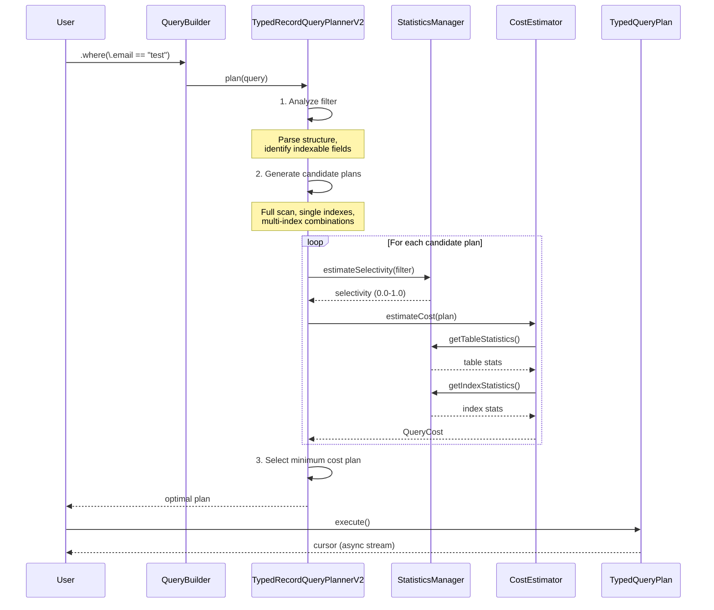

# Query Planner Optimization with Index Selection

**Last Updated**: 2025-01-05
**Status**: Design Phase
**Author**: Claude Code Assistant

## Table of Contents

1. [Overview](#overview)
2. [Current Implementation Analysis](#current-implementation-analysis)
3. [Design Goals](#design-goals)
4. [Architecture](#architecture)
5. [Index Selection Algorithm](#index-selection-algorithm)
6. [Cost-Based Optimization](#cost-based-optimization)
7. [Query Type Optimizations](#query-type-optimizations)
8. [Implementation Plan](#implementation-plan)
9. [Testing Strategy](#testing-strategy)
10. [Performance Considerations](#performance-considerations)

---

## Overview

This document describes the design of the enhanced query planner with cost-based index selection for FDB Record Layer (Swift). The query planner is responsible for:

1. **Analyzing queries** to understand filter conditions and access patterns
2. **Selecting optimal indexes** from available candidates
3. **Generating execution plans** with estimated costs
4. **Choosing the best plan** based on cost comparison

### Key Features

- **Cost-based optimization**: Uses statistics and histograms for accurate cost estimation
- **Multiple plan generation**: Evaluates all viable execution strategies
- **Complex query support**: Handles AND, OR, NOT, and compound expressions
- **Index selection**: Chooses optimal indexes or index combinations
- **Adaptive optimization**: Uses collected statistics to improve over time

---

## Current Implementation Analysis

### ✅ What's Implemented

#### 1. TypedRecordQueryPlanner (Basic)

**Location**: `Sources/FDBRecordLayer/Query/TypedRecordQueryPlanner.swift`

**Current Capabilities**:
- Simple field-based filter matching
- Single index selection (first match)
- Basic plan types: Full Scan, Index Scan, Limit
- Range query support (equals, <, <=, >, >=)

**Limitations** (Lines 99-102):
```swift
// Only handle simple field comparisons for now
// TODO: Support AND, OR, complex expressions
guard let fieldFilter = filter as? TypedFieldQueryComponent<Record> else {
    return nil
}
```

**Key Issue**: No cost-based selection - uses first matching index (Lines 72-81):
```swift
for index in applicableIndexes {
    // Try to match filter with index
    if let plan = try matchFilterWithIndex(...) {
        return plan  // ← Returns immediately, no cost comparison
    }
}
```

#### 2. StatisticsManager (Complete)

**Location**: `Sources/FDBRecordLayer/Query/StatisticsManager.swift`

**Capabilities**:
- Table statistics: row count, average row size
- Index statistics: cardinality, null count, min/max values
- Histogram construction with configurable buckets
- Selectivity estimation for all comparison operators
- Recursive estimation for AND/OR/NOT queries

**Key Methods**:
- `collectStatistics()`: Scans records with sampling
- `collectIndexStatistics()`: Builds histograms
- `estimateSelectivity()`: Calculates filter selectivity (0.0-1.0)

#### 3. CostEstimator (Complete)

**Location**: `Sources/FDBRecordLayer/Query/CostEstimator.swift`

**Capabilities**:
- I/O cost estimation (key-value reads)
- CPU cost estimation (deserialization, filtering)
- Plan-specific cost models:
  - Full Scan: scans all rows
  - Index Scan: index lookup + record fetch
  - Intersection: combines multiple index scans
  - Union: merges multiple index scans
  - Limit: reduces child cost proportionally

**Cost Model**:
```swift
totalCost = ioCost + cpuCost * 0.1  // I/O dominates
```

#### 4. Query Plan Types

**Location**: `Sources/FDBRecordLayer/Query/TypedQueryPlan.swift`

**Available Plans**:
- `TypedFullScanPlan`: Scans entire table with optional filter
- `TypedIndexScanPlan`: Scans index + fetches records
- `TypedLimitPlan`: Limits result count
- `TypedIntersectionPlan`: Combines multiple plans (AND logic)
- `TypedUnionPlan`: Merges multiple plans (OR logic)

**Issues**:
- Intersection/Union load all results into memory (Lines 193-197, 257-260)
- Intersection comparison logic unimplemented (Line 214: `true // simplified`)
- No streaming support for large result sets

### 🚧 What Needs Improvement

1. **No Cost-Based Selection**:
   - Planner doesn't use CostEstimator
   - First matching index is chosen without comparison
   - No evaluation of alternative plans

2. **Limited Query Type Support**:
   - AND queries: not optimized with multiple indexes
   - OR queries: not optimized with union of index scans
   - Compound indexes: prefix matching not implemented

3. **Memory-Inefficient Plans**:
   - Intersection/Union materialize entire result sets
   - Need streaming implementations for large results

4. **Missing Optimizations**:
   - Covering indexes: not considered
   - Index-only scans: not implemented
   - Filter pushdown: not optimized

---

## Design Goals

### Primary Goals

1. **Correctness**: Always produce correct results, never incorrect optimizations
2. **Performance**: Choose plans with lowest estimated cost
3. **Scalability**: Handle large datasets efficiently
4. **Extensibility**: Easy to add new plan types and optimizations

### Secondary Goals

1. **Predictability**: Consistent plan selection for similar queries
2. **Debuggability**: Clear explanations of plan choices
3. **Adaptability**: Improve with collected statistics
4. **Simplicity**: Avoid over-engineering for rare cases

### Non-Goals

1. **SQL compatibility**: Not building a full SQL engine
2. **Distributed queries**: Single-database queries only
3. **Advanced features**: No JOINs, subqueries, or aggregations (yet)

---

## Architecture

### High-Level Architecture

```
┌────────────────────────────────────────────────────────┐
│                   QueryBuilder<T>                       │
│             (User-facing API)                          │
└──────────────────┬─────────────────────────────────────┘
                   │ builds
                   ▼
┌────────────────────────────────────────────────────────┐
│              TypedRecordQuery<T>                       │
│   - filter: TypedQueryComponent                        │
│   - sort: [SortKey]?                                   │
│   - limit: Int?                                        │
└──────────────────┬─────────────────────────────────────┘
                   │ passes to
                   ▼
┌────────────────────────────────────────────────────────┐
│         TypedRecordQueryPlannerV2<T>                   │
│         (Enhanced Planner)                             │
│   ┌────────────────────────────────────────────┐      │
│   │ 1. Query Analysis                          │      │
│   │    - Parse filter structure                │      │
│   │    - Identify indexable conditions         │      │
│   │    - Normalize to DNF (OR of ANDs)         │      │
│   └────────────────────────────────────────────┘      │
│   ┌────────────────────────────────────────────┐      │
│   │ 2. Plan Generation                         │      │
│   │    - Full scan plan                        │      │
│   │    - Single index plans                    │      │
│   │    - Multi-index intersection plans        │      │
│   │    - Multi-index union plans               │      │
│   └────────────────────────────────────────────┘      │
│   ┌────────────────────────────────────────────┐      │
│   │ 3. Cost Estimation                         │      │
│   │    - Use StatisticsManager                 │      │
│   │    - Calculate I/O + CPU costs             │      │
│   │    - Consider data distribution            │      │
│   └────────────────────────────────────────────┘      │
│   ┌────────────────────────────────────────────┐      │
│   │ 4. Plan Selection                          │      │
│   │    - Compare costs                         │      │
│   │    - Choose minimum cost                   │      │
│   │    - Break ties with plan hash             │      │
│   └────────────────────────────────────────────┘      │
└──────────────────┬─────────────────────────────────────┘
                   │ returns
                   ▼
┌────────────────────────────────────────────────────────┐
│           any TypedQueryPlan<T>                        │
│   - TypedFullScanPlan                                  │
│   - TypedIndexScanPlan                                 │
│   - TypedIntersectionPlan                              │
│   - TypedUnionPlan                                     │
│   - TypedLimitPlan                                     │
└──────────────────┬─────────────────────────────────────┘
                   │ executes
                   ▼
┌────────────────────────────────────────────────────────┐
│         AnyTypedRecordCursor<T>                        │
│              (Result Stream)                           │
└────────────────────────────────────────────────────────┘
```

### Component Interaction



---

## Index Selection Algorithm

### Algorithm Overview

The index selection algorithm follows these steps:

```
ALGORITHM: selectBestPlan(query, recordType)
INPUT:
  - query: TypedRecordQuery<T>
  - recordType: String
OUTPUT:
  - optimal execution plan: TypedQueryPlan<T>

STEPS:
1. ANALYZE_QUERY(query.filter)
   → Extract indexable conditions
   → Identify AND/OR structure
   → Normalize to DNF if needed

2. GENERATE_CANDIDATE_PLANS(query, recordType)
   → Full scan plan (baseline)
   → For each applicable index:
       → Single index plan
   → For AND queries:
       → Multi-index intersection plans
   → For OR queries:
       → Multi-index union plans

3. ESTIMATE_COSTS(candidates, recordType)
   → For each plan:
       → Get statistics
       → Calculate I/O cost
       → Calculate CPU cost
       → Compute total cost

4. SELECT_OPTIMAL_PLAN(candidates)
   → Sort by total cost (ascending)
   → Return plan with minimum cost
   → On tie: use plan hash for stability

5. APPLY_LIMIT(plan, query.limit)
   → Wrap in TypedLimitPlan if limit specified

RETURN optimal plan
```

### Detailed Steps

#### Step 1: Query Analysis

**Goal**: Understand the structure of the filter to identify optimization opportunities.

**Process**:
1. Parse filter into tree structure
2. Identify leaf conditions (field comparisons)
3. Detect AND/OR/NOT operators
4. Extract indexable fields

**Example**:
```swift
// Query: .where(\.city == "Tokyo" && \.age > 18)
// Analysis result:
// - Type: AND
// - Left: FieldComparison(city, equals, "Tokyo")
// - Right: FieldComparison(age, greaterThan, 18)
// - Indexable fields: ["city", "age"]
```

#### Step 2: Plan Generation

**Goal**: Create all viable execution plans.

##### 2.1 Full Scan Plan (Baseline)

Always generated as fallback:
```swift
let fullScanPlan = TypedFullScanPlan(
    filter: query.filter,
    expectedRecordType: recordType
)
candidates.append(fullScanPlan)
```

**When Optimal**: Small tables, no suitable indexes, or high selectivity (most rows match).

##### 2.2 Single Index Plans

For each applicable index:
```swift
for index in applicableIndexes {
    if let plan = try matchFilterWithIndex(filter, index) {
        candidates.append(plan)
    }
}
```

**Matching Rules**:
- **Exact match**: Index field == filter field
- **Prefix match**: Compound index prefix matches filter fields
- **Range support**: Index supports comparison operator

**Example**:
```swift
// Index: user_by_email (email)
// Query: .where(\.email == "test@example.com")
// → IndexScanPlan(index: "user_by_email", range: ["test@example.com", "test@example.com"])
```

##### 2.3 Multi-Index Intersection (AND Queries)

When filter is `AND`:
```swift
// Query: .where(\.city == "Tokyo" && \.age > 18)
// Indexes:
// - user_by_city (city)
// - user_by_age (age)

// Generate intersection plan:
let cityPlan = IndexScanPlan(index: "user_by_city", range: ["Tokyo", "Tokyo"])
let agePlan = IndexScanPlan(index: "user_by_age", range: [18, nil])
let intersectionPlan = TypedIntersectionPlan(
    children: [cityPlan, agePlan],
    comparisonKey: ["userID"]  // Primary key for merging
)
candidates.append(intersectionPlan)
```

**When Better Than Single Index**:
- Both indexes highly selective
- No compound index covering both fields
- Intersection cost < full scan cost

##### 2.4 Multi-Index Union (OR Queries)

When filter is `OR`:
```swift
// Query: .where(\.city == "Tokyo" || \.city == "Osaka")
// Index: user_by_city (city)

// Generate union plan:
let tokyoPlan = IndexScanPlan(index: "user_by_city", range: ["Tokyo", "Tokyo"])
let osakaPlan = IndexScanPlan(index: "user_by_city", range: ["Osaka", "Osaka"])
let unionPlan = TypedUnionPlan(children: [tokyoPlan, osakaPlan])
candidates.append(unionPlan)
```

**When Better Than Full Scan**:
- Each OR branch is selective
- Union cost < full scan cost

##### 2.5 Compound Index Plans

**Prefix Matching**:
```swift
// Compound Index: user_by_city_age (city, age)
// Query: .where(\.city == "Tokyo")
// → Can use index with range: [("Tokyo", min), ("Tokyo", max)]

// Query: .where(\.city == "Tokyo" && \.age > 18)
// → Can use index with range: [("Tokyo", 18), ("Tokyo", max)]

// Query: .where(\.age > 18)
// → CANNOT use index (age is not prefix)
```

**Rules**:
1. Match fields from left to right
2. Stop at first unmatched field
3. All fields left of matched fields must be specified

#### Step 3: Cost Estimation

For each candidate plan, estimate cost using `CostEstimator`:

```swift
let cost = try await costEstimator.estimateCost(plan, recordType: recordType)
// Returns: QueryCost(ioCost, cpuCost, estimatedRows)
```

**Cost Components**:
- **I/O Cost**: Number of key-value reads from FDB
- **CPU Cost**: Deserialization + filtering overhead
- **Total Cost**: `ioCost + cpuCost * 0.1` (I/O dominates)

**Cost Formulas**:

| Plan Type | I/O Cost | CPU Cost |
|-----------|----------|----------|
| Full Scan | `rowCount * ioReadCost` | `rowCount * (deserializeCost + filterCost)` |
| Index Scan | `estimatedRows * 2 * ioReadCost` | `estimatedRows * (deserializeCost + filterCost)` |
| Intersection | `sum(child.ioCost)` | `min(child.estimatedRows) * filterCost * childCount` |
| Union | `sum(child.ioCost)` | `sum(child.cpuCost)` |
| Limit | `child.cost * limitFactor` | `child.cpuCost * limitFactor` |

**Note**: Index Scan reads twice (index entry + record).

#### Step 4: Plan Selection

Sort candidates by total cost and select minimum:

```swift
let sortedPlans = candidates.sorted { lhs, rhs in
    let lhsCost = costs[lhs]!.totalCost
    let rhsCost = costs[rhs]!.totalCost

    if abs(lhsCost - rhsCost) < 0.01 {
        // Tie: use plan hash for stability
        return lhs.planHash < rhs.planHash
    }

    return lhsCost < rhsCost
}

return sortedPlans.first!
```

**Tie-Breaking**:
- Use plan hash to ensure deterministic selection
- Prevents plan flapping due to minor cost differences

#### Step 5: Apply Limit

If query has limit, wrap plan:

```swift
if let limit = query.limit {
    return TypedLimitPlan(child: optimalPlan, limit: limit)
}
return optimalPlan
```

**Benefit**: Limit can short-circuit execution, reducing actual I/O.

---

## Cost-Based Optimization

### Cost Model

The cost model estimates the "work" required to execute a plan:

```
TotalCost = I/O_Cost + CPU_Cost * α

where:
  α = 0.1  (I/O dominates, CPU is 10% weight)
```

#### I/O Cost

**Assumption**: Disk I/O is the bottleneck.

**Components**:
- **Key-value reads**: Each FDB read operation
- **Network latency**: Assumed constant per read
- **Sequential vs Random**: Not distinguished (conservative)

**Formula**:
```
I/O_Cost = num_reads * io_read_cost

where:
  io_read_cost = 1.0 (baseline unit)
```

#### CPU Cost

**Assumption**: CPU is fast compared to I/O.

**Components**:
- **Deserialization**: Protobuf decoding
- **Filtering**: Predicate evaluation
- **Tuple unpacking**: Index key parsing

**Formula**:
```
CPU_Cost = num_records * (deserialize_cost + filter_cost)

where:
  deserialize_cost = 0.1
  filter_cost = 0.05
```

### Selectivity Estimation

**Selectivity**: Fraction of rows matching a condition (0.0 to 1.0).

#### Using Statistics

**With Histogram** (accurate):
```swift
let histogram = indexStats.histogram
let selectivity = histogram.estimateSelectivity(
    comparison: .equals,
    value: ComparableValue("Tokyo")
)
// Uses bucket counts and distribution
```

**Without Histogram** (heuristic):
```swift
switch comparison {
case .equals: return 0.01  // 1% of rows
case .notEquals: return 0.99
case .lessThan, .greaterThan: return 0.33  // 1/3 of range
case .startsWith: return 0.1  // 10% for prefix
case .contains: return 0.2  // 20% for substring
}
```

#### Combining Selectivities

**AND** (independence assumption):
```
selectivity(A AND B) = selectivity(A) * selectivity(B)
```

**OR** (inclusion-exclusion):
```
selectivity(A OR B) = 1 - (1 - selectivity(A)) * (1 - selectivity(B))
```

**NOT**:
```
selectivity(NOT A) = 1 - selectivity(A)
```

**Example**:
```swift
// Query: .where(\.city == "Tokyo" && \.age > 18)
// Assumptions:
// - 10% of users are in Tokyo
// - 66% of users are over 18
// - Independence: city and age are uncorrelated

selectivity = 0.10 * 0.66 = 0.066 (6.6% of rows)
```

### Plan Comparison Example

**Scenario**:
- Table: 1,000,000 rows
- Indexes:
  - `user_by_email`: cardinality 1,000,000 (unique)
  - `user_by_city`: cardinality 1,000 (1,000 cities)
- Query: `.where(\.email == "test@example.com")`

**Candidate Plans**:

| Plan | Selectivity | Estimated Rows | I/O Cost | CPU Cost | Total Cost |
|------|-------------|----------------|----------|----------|------------|
| Full Scan | 0.000001 | 1 | 1,000,000 | 150,000 | 1,015,000 |
| Index Scan (email) | 0.000001 | 1 | 2 | 0.15 | 2.015 |

**Decision**: Index Scan (email) is **500,000x cheaper** → **Selected**.

---

## Query Type Optimizations

### AND Queries

**Goal**: Find records matching ALL conditions.

#### Strategy 1: Single Index (Most Common)

**When to Use**:
- Compound index covers all fields
- One field is highly selective

**Example**:
```swift
// Query: .where(\.city == "Tokyo" && \.age > 18)
// Index: user_by_city_age (city, age)
// Plan: IndexScan(index: "user_by_city_age", range: [("Tokyo", 18), ("Tokyo", max)])
```

#### Strategy 2: Index Intersection

**When to Use**:
- No compound index available
- Multiple selective conditions
- Each index highly selective

**Example**:
```swift
// Query: .where(\.email == "test" && \.phone == "123")
// Indexes: user_by_email, user_by_phone (both unique)
// Plan: Intersection(
//   IndexScan(email),
//   IndexScan(phone)
// )
// Both scans return 1 row → intersection is 0 or 1 row
```

**Implementation**:
```swift
// Sort children by selectivity (smallest first)
let sortedChildren = children.sorted { lhs, rhs in
    lhs.estimatedRows < rhs.estimatedRows
}

// Fetch smallest result set first
let smallestResults = await sortedChildren[0].execute(...)

// Filter by other conditions
var results = smallestResults
for child in sortedChildren.dropFirst() {
    let childResults = await child.execute(...)
    results = intersect(results, childResults, by: primaryKey)
}
```

**Cost Formula**:
```
I/O_Cost = sum(child.ioCost)
CPU_Cost = min(child.estimatedRows) * filterCost * childCount
EstimatedRows = product(child.selectivity) * rowCount
```

#### Strategy 3: Filter After Scan

**When to Use**:
- No suitable indexes
- All conditions have low selectivity
- Table is small

**Example**:
```swift
// Query: .where(\.age > 18 && \.age < 65)
// No index on age
// Plan: FullScan with filter
```

### OR Queries

**Goal**: Find records matching ANY condition.

#### Strategy 1: Union of Index Scans

**When to Use**:
- Each OR branch can use an index
- Union cost < full scan cost

**Example**:
```swift
// Query: .where(\.city == "Tokyo" || \.city == "Osaka")
// Index: user_by_city
// Plan: Union(
//   IndexScan(city == "Tokyo"),
//   IndexScan(city == "Osaka")
// )
```

**Implementation**:
```swift
var allResults: Set<Record> = []

for child in children {
    let childResults = await child.execute(...)
    for record in childResults {
        allResults.insert(record)  // Deduplicate by primary key
    }
}

return allResults
```

**Cost Formula**:
```
I/O_Cost = sum(child.ioCost)
CPU_Cost = sum(child.cpuCost)
EstimatedRows = sum(child.estimatedRows) * deduplicationFactor
```

**Note**: `deduplicationFactor = 0.9` (assume 10% overlap).

#### Strategy 2: Full Scan with Filter

**When to Use**:
- No suitable indexes for OR branches
- OR conditions have high selectivity
- Table is small

**Example**:
```swift
// Query: .where(\.age > 18 || \.city == "Tokyo")
// No compound index
// selectivity(age > 18) = 0.66
// selectivity(city == "Tokyo") = 0.10
// combined = 1 - (1-0.66)*(1-0.10) = 0.694 (69.4%)
// → Full scan is likely cheaper
```

### NOT Queries

**Challenge**: Hard to optimize with indexes.

#### Strategy 1: Complement Scan (if possible)

**Example**:
```swift
// Query: .where(NOT(\.status == "deleted"))
// If status has only 2 values: ["active", "deleted"]
// Rewrite: .where(\.status == "active")
// → Use index on status
```

#### Strategy 2: Full Scan with Filter

**Most Common**:
```swift
// Query: .where(NOT(\.age > 18))
// Equivalent: .where(\.age <= 18)
// → Can use index if available
```

### Range Queries

**Goal**: Efficiently scan ordered ranges.

#### Single-Field Range

**Example**:
```swift
// Query: .where(\.age > 18 && \.age < 65)
// Index: user_by_age
// Plan: IndexScan(index: "user_by_age", range: [18, 65])
```

**Selectivity**: Use histogram for accurate estimation.

#### Multi-Field Range (Compound Index)

**Example**:
```swift
// Query: .where(\.city == "Tokyo" && \.age > 18)
// Index: user_by_city_age (city, age)
// Plan: IndexScan(range: [("Tokyo", 18), ("Tokyo", max)])
```

**Key Insight**: Compound index enables range scan on second field after exact match on first.

### Compound Index Prefix Matching

**Rules**:
1. Match fields left-to-right
2. Exact match or range on each field
3. Cannot skip fields

**Examples**:

| Index | Query | Usable? | Reason |
|-------|-------|---------|--------|
| (city, age) | `city == "Tokyo"` | ✅ Yes | Prefix match |
| (city, age) | `city == "Tokyo" && age > 18` | ✅ Yes | Full prefix + range |
| (city, age) | `age > 18` | ❌ No | Skips city (first field) |
| (city, age, name) | `city == "Tokyo" && name == "Alice"` | ❌ No | Skips age (middle field) |
| (city, age, name) | `city == "Tokyo" && age > 18` | ✅ Yes | Prefix + range (name ignored) |

---

## Implementation Plan

### Phase 1: Enhanced Planner Foundation

**Goal**: Refactor planner to support multiple plan generation.

**Tasks**:
1. Create `TypedRecordQueryPlannerV2<Record>`
2. Implement query analysis:
   - `analyzeFilter()`: Parse filter structure
   - `extractIndexableFields()`: Identify fields with indexes
3. Implement plan generation:
   - `generateFullScanPlan()`
   - `generateSingleIndexPlans()`
4. Integrate `CostEstimator`:
   - Pass `StatisticsManager` to planner
   - Call `estimateCost()` for each plan
5. Implement plan selection:
   - `selectOptimalPlan()`: Sort by cost, choose minimum

**Acceptance Criteria**:
- Planner generates multiple candidate plans
- Costs are calculated for each plan
- Optimal plan is selected based on cost
- Tests: simple field queries with single index

### Phase 2: Compound Index Support

**Goal**: Support compound indexes with prefix matching.

**Tasks**:
1. Implement `matchCompoundIndex()`:
   - Check field order matches index
   - Support prefix matching
   - Generate range scan keys
2. Update `matchFilterWithIndex()` to handle compound indexes
3. Add tests for compound index queries

**Acceptance Criteria**:
- Compound indexes are used when applicable
- Prefix matching works correctly
- Range queries on last matched field work

### Phase 3: AND Query Optimization

**Goal**: Optimize AND queries with index intersection.

**Tasks**:
1. Implement `generateIntersectionPlans()`:
   - Identify AND filters
   - Generate intersection for each index pair
   - Calculate intersection cost
2. Refactor `TypedIntersectionPlan` for streaming:
   - Remove memory materialization
   - Implement merge-join algorithm
   - Use primary key for merging
3. Add tests for AND queries

**Acceptance Criteria**:
- Index intersection plans are generated
- Planner chooses intersection when optimal
- Streaming execution works for large results

### Phase 4: OR Query Optimization

**Goal**: Optimize OR queries with index union.

**Tasks**:
1. Implement `generateUnionPlans()`:
   - Identify OR filters
   - Generate union for each index combination
   - Calculate union cost with deduplication
2. Refactor `TypedUnionPlan` for streaming:
   - Remove memory materialization
   - Implement merge-union algorithm
   - Deduplicate by primary key
3. Add tests for OR queries

**Acceptance Criteria**:
- Index union plans are generated
- Planner chooses union when optimal
- Streaming execution works for large results

### Phase 5: Advanced Optimizations

**Goal**: Add covering indexes and index-only scans.

**Tasks**:
1. Implement covering index detection:
   - Check if index contains all projected fields
   - Skip record fetch if covered
2. Implement `TypedIndexOnlyScanPlan`:
   - Read from index only
   - No record lookup
3. Implement filter pushdown:
   - Evaluate filters during scan
   - Short-circuit when possible

**Acceptance Criteria**:
- Covering indexes are detected
- Index-only scans are used when possible
- Performance improvement measurable

### Phase 6: Query Plan Caching

**Goal**: Cache query plans for repeated queries.

**Tasks**:
1. Implement `PlanCache`:
   - Key: query hash
   - Value: compiled plan
   - LRU eviction policy
2. Add cache invalidation on metadata changes
3. Add cache statistics

**Acceptance Criteria**:
- Repeated queries use cached plans
- Cache hit rate > 80% in tests
- Metadata changes invalidate cache

---

## Testing Strategy

### Unit Tests

**Component**: `TypedRecordQueryPlannerV2`

**Test Cases**:
1. **Simple field query**:
   - Input: `.where(\.email == "test")`
   - Verify: Index scan selected, cost calculated
2. **No matching index**:
   - Input: `.where(\.field_without_index == "value")`
   - Verify: Full scan selected
3. **Compound index**:
   - Input: `.where(\.city == "Tokyo" && \.age > 18)`
   - Verify: Compound index used, correct range
4. **AND query**:
   - Input: `.where(\.email == "test" && \.phone == "123")`
   - Verify: Intersection plan generated and selected when optimal
5. **OR query**:
   - Input: `.where(\.city == "Tokyo" || \.city == "Osaka")`
   - Verify: Union plan generated and selected when optimal

### Integration Tests

**Component**: End-to-end query execution

**Test Cases**:
1. **Correctness**: All plan types return same results
2. **Performance**: Index scan faster than full scan
3. **Statistics**: Plans improve with collected statistics
4. **Large datasets**: Streaming works with millions of rows

### Benchmark Tests

**Goal**: Measure performance improvements.

**Scenarios**:
1. **Baseline**: Full scan vs index scan
2. **AND queries**: Intersection vs full scan
3. **OR queries**: Union vs full scan
4. **Compound indexes**: Single vs multiple indexes

**Metrics**:
- Query latency (p50, p95, p99)
- I/O operations count
- Memory usage
- CPU time

---

## Performance Considerations

### Memory Usage

**Issue**: Intersection/Union currently materialize results.

**Solution**:
- Implement streaming merge-join for intersection
- Implement streaming merge-union for union
- Use fixed-size buffers for intermediate results

**Target**: Constant memory usage regardless of result size.

### Index Statistics Overhead

**Issue**: Collecting statistics is expensive.

**Solution**:
- Use sampling (10% default)
- Run statistics collection as background job
- Cache statistics with TTL (1 hour default)
- Incremental updates for frequently changing data

**Trade-off**: Slightly stale statistics vs. overhead.

### Query Planning Overhead

**Issue**: Generating and costing many plans takes time.

**Solution**:
- Limit candidate plans (max 10)
- Cache query plans
- Use heuristics for obvious cases (unique index on equality)

**Target**: Query planning < 1ms for simple queries.

### Cost Model Tuning

**Issue**: Cost constants may not match actual performance.

**Solution**:
- Collect runtime statistics
- Compare estimated vs actual costs
- Adjust constants based on feedback
- Machine-specific calibration

**Constants to Tune**:
```swift
private let ioReadCost: Double = 1.0        // Baseline
private let cpuDeserializeCost: Double = 0.1
private let cpuFilterCost: Double = 0.05
```

---

## Future Enhancements

### Adaptive Query Execution

**Concept**: Adjust plan during execution based on actual data.

**Example**:
- Estimated 1,000 rows, actually 1,000,000 → switch to different strategy
- Requires runtime statistics and plan switching

### Join Support

**Concept**: Optimize joins between record types.

**Example**:
```swift
// Query: find orders with user in Tokyo
orders.where { order in
    order.user.city == "Tokyo"
}
```

**Strategies**:
- Nested loop join
- Hash join
- Merge join

### Parallel Execution

**Concept**: Execute independent parts of plan in parallel.

**Example**:
- Union: fetch from each index in parallel
- Intersection: fetch all indexes in parallel, then merge

### Histograms with Correlation

**Current Limitation**: Assumes independence between fields.

**Enhancement**: Track correlation between fields (e.g., age and income).

**Benefit**: More accurate selectivity for multi-field queries.

---

## References

### Internal Documents

- [ARCHITECTURE.md](./ARCHITECTURE.md): Overall system architecture
- [API_DESIGN.md](../API_DESIGN.md): Public API design
- [CLAUDE.md](../../CLAUDE.md): FoundationDB and Record Layer guide

### External Resources

- [FoundationDB Record Layer (Java)](https://foundationdb.github.io/fdb-record-layer/): Original implementation
- [Cascades Optimizer](https://15721.courses.cs.cmu.edu/spring2018/papers/14-optimizer2/graefe-ieee1995.pdf): Cost-based optimization framework
- [PostgreSQL Query Planner](https://www.postgresql.org/docs/current/planner-optimizer.html): Mature cost-based planner

---

## Appendix

### A. Cost Estimation Formulas

#### Full Scan

```
I/O_Cost = rowCount * ioReadCost
CPU_Cost = rowCount * (deserializeCost + filterCost)
EstimatedRows = rowCount * selectivity
```

#### Index Scan

```
I/O_Cost = estimatedRows * 2 * ioReadCost  // index + record
CPU_Cost = estimatedRows * (deserializeCost + filterCost)
EstimatedRows = rowCount * indexSelectivity * filterSelectivity
```

#### Intersection

```
I/O_Cost = sum(child.ioCost)
CPU_Cost = min(child.estimatedRows) * filterCost * childCount
EstimatedRows = rowCount * product(child.selectivity)
```

#### Union

```
I/O_Cost = sum(child.ioCost)
CPU_Cost = sum(child.cpuCost)
EstimatedRows = sum(child.estimatedRows) * deduplicationFactor
```

#### Limit

```
limitFactor = min(1.0, limit / child.estimatedRows)
I/O_Cost = child.ioCost * limitFactor
CPU_Cost = child.cpuCost * limitFactor
EstimatedRows = min(limit, child.estimatedRows)
```

### B. Selectivity Heuristics (No Statistics)

| Comparison | Heuristic Selectivity | Reasoning |
|------------|----------------------|-----------|
| `==` | 0.01 (1%) | Assume high cardinality field |
| `!=` | 0.99 (99%) | Complement of equals |
| `<` | 0.33 (33%) | Assume uniform distribution, 1/3 of range |
| `<=` | 0.33 (33%) | Same as < |
| `>` | 0.33 (33%) | Symmetric with < |
| `>=` | 0.33 (33%) | Same as > |
| `startsWith` | 0.1 (10%) | Prefix match on string |
| `contains` | 0.2 (20%) | Substring match (less selective) |

### C. Plan Selection Decision Tree

```
START
│
├─ Has statistics?
│  ├─ Yes → Use cost-based selection
│  │        └─ Generate all candidates
│  │           └─ Estimate costs
│  │              └─ Select minimum cost
│  │
│  └─ No → Use heuristics
│           ├─ Unique index on equality? → Index Scan
│           ├─ Any index matches? → Index Scan
│           └─ Otherwise → Full Scan
│
END
```

---

**End of Document**
